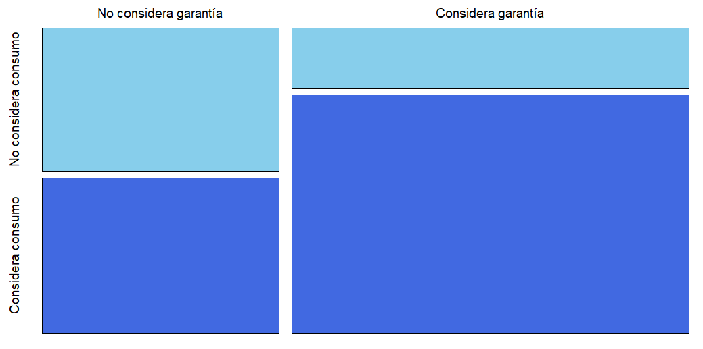
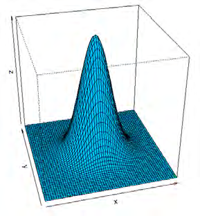

# Capítulo 2: Introducción al Análisis de Datos

> *La Estadística es una ciencia que demuestra que si mi vecino tiene dos autos y yo ninguno, los dos tenemos uno.*  
> — **George Bernard Shaw**

---


### 2.1 Variables: niveles de medición

El análisis descriptivo es el paso inicial generalmente recomendado para comprender la
estructura de los datos disponibles y la extracción de la información relevante para el

análisis.
Describir cualquier situación real, por ejemplo, las características físicas de una raza
de vacas, la situación financiera de una empresa, las particularidades de la producción de
una planta, requiere tener en cuenta simultáneamente el comportamiento y la interacción
entre las variables.
Las variables pueden ser, según su nivel de medición:
- Categóricas o cualitativas: Las distintas modalidades que adoptan estas variables
sólo se distinguen por ser diferentes, no se puede establecer un ordenamiento entre
ellos. Son ejemplos de estas variables: color de cabello, tipo de auto, sexo.
- Cuasicuantitativas u ordinales: En estas variables, si bien se puede ordenar las
modalidades que adopta, no se puede establecer una distancia entre ellas. Por
ejemplo: calificación de examen (A, B, C, D y E), estadío de una enfermedad (I, II,
III o IV).
- Cuantitativas discretas: Estas variables toman valores numéricos siendo que entre dos valores consecutivos de las mismas no existen valores intermedios. Pueden
tomar un conjunto a lo sumo numerable de valores, vinculándose generalmente al
proceso de contar. Son ejemplos de estas variables: cantidad de hijos, cantidad de
materias aprobadas, dinero en una billetera.


<!-- PDF Page 15 -->
2.1. VARIABLES: NIVELES DE MEDICIÓN


- Cuantitativas continuas: Estas variables también toman valores numéricos, pero
entre dos valores de la variable existen infinitos valores intermedios, asociándose
generalmente al proceso de medir. Son ejemplos de estas variables: peso, edad,
duración de un llamado.
Existen otras formas de medición, asociadas generalmente a la subjetividad del individuo.
Por ejemplo las escalas analógicas o visuales que se utilizan en muchas ocasiones
para que el paciente indique el grado de alguna variable “de nivel subjetivo” como dolor,
bienestar, agrado, acuerdo-desacuerdo o sensaciones en general. Un ejemplo de ello es
el tratamiento del dolor, ver Figura 2.1. A los pacientes se les suele pedir que indiquen
en una línea entre 0 y 10 que une los extremos sin dolor y dolor intolerable, cuál es su
posición.
Dolor intorelable

Sin dolor

Figura 2.1: Escala visual

Estas escalas son útiles para evaluar la progresión de un mismo individuo pero debe
tenerse en cuenta el carácter subjetivo de esta escala a la hora de intentar comparar
entre individuos.
Otro ejemplo podría ser el estudio de la satisfacción de los clientes con algún servicio
en particular previa y posterior a alguna mejora o actualización de dicho servicio.
Es usual que el método de análisis de este tipo de variables esté basado en rangos
de scores.


#### 2.1.1 Presentación de los datos

Una vez definida la base de datos con toda la información disponible, es necesario ordenarla y organizarla, a fin de facilitar su comprensión e interpretación. El análisis sobre
los datos crudos, puede resultar inabordable.
Surge naturalmente la siguiente pregunta:
¿Cómo convendría entonces organizar la información?
Si se desea analizar una sola variable, el paso inicial más sencillo es confeccionar
una tabla denominada distribución de frecuencias; que tiene un aspecto particular para
cada tipo de variable de las consideradas.


<!-- PDF Page 16 -->
2.1. VARIABLES: NIVELES DE MEDICIÓN


1. Para datos cualitativos:
Las clases se definen según el interés de la investigación.
Se cuenta la cantidad de observaciones de cada clase. A dicha cantidad se la
conoce como frecuencia absoluta observada.
Ejemplo 2.1. Estudiamos los tipos de autos vendidos en una concesionaria de
Capital Federal durante el mes pasado.

https://flic.kr/p/bx4uHH

Para ello, se construye una distribución de frecuencias donde a cada categoría o
modalidad de la variable se le asigna su frecuencia absoluta; es decir, el número
de veces que se ha registrado dicha categoría en la muestra de observaciones.

| Modelo | Frecuencia |
| :--- | :---: |
| Utilitario | 6 |
| Familiar | 10 |
| Cupé | 7 |
| Camioneta | 12 |
| Sedán | 17 |

*Tabla 2.1: Ejemplo de distribución de frecuencias*


2. Para datos cuantitativos:
- En el caso de variables discretas, las modalidades quedan definidas por los
valores del recorrido de la variable.
- En el caso de variables continuas, es necesario definir intervalos que cubran
el recorrido de la variable en estudio, denominados “intervalos de clase”.
- En ambos casos, se registra la frecuencia absoluta de cada modalidad (cantidad de observaciones en ella) o de cada intervalo (cantidad de observaciones
dentro del rango del intervaEjemplo 2.2. Estudiamos ahora la evolución de las ventas de vehículos de alta
gama, en la misma sucursal durante los últimos 24 meses.

| Alta gama | Meses |
| :---: | :---: |
| 1 | 2 |
| 2 | 3 |
| 3 | 7 |
| 4 | 4 |
| 5 | 8 |

*Tabla 2.2: Ejemplo de variable discreta*

La Tabla 2.2 indica que en 7 de los meses observados se han vendido 3 vehículos
de alta gama, 8 meses en los que se han vendido 5 vehículos de alta gama, etc.

Ejemplo 2.3. Estamos interesados en investigar la cantidad de proteínas en gramos
consumidas por día per cápita para una muestra de habitantes de distintos partidos
del Gran Buenos Aires.

| Intervalo de clase | $f_i$ (frec. absoluta) |
| :---: | :---: |
| $[7, 9)$ | 6 |
| $[9, 11)$ | 10 |
| $[11, 13)$ | 4 |
| $[13, 15)$ | 7 |
| $[15, 17)$ | 5 |

*Tabla 2.3: Ejemplo de frecuencias absolutas*

La Tabla 2.3 informa, por ejemplo, que 4 individuos consumieron entre 11 y 13
gramos de proteínas por día. Pero no nos da una idea de la concentración de nuestra población de interés en dicha categoría. Por este motivo, es usual incorporar las
frecuencias porcentuales en estas tablas.

Para calcular las frecuencias porcentuales, es necesario recordar que la suma de
las frecuencias observadas en las $m$ modalidades de la variable $f_i$, con $1 \le i \le m$,
es igual a la cantidad total de observaciones $n$, registradas en las mismas de la
variable; es decir, se tiene que $f_1 + f_2 + \dots + f_m = n$.

La frecuencia relativa se calcula dividiendo la frecuencia absoluta por la cantidad
total de observaciones $f_i / n$ y la frecuencia porcentual $f_{r_i}$ se obtiene multiplicando
estos resultados por 100. Así, por ejemplo, la frecuencia relativa de la clase $[11, 13)$

<!-- PDF Page 18 -->

resulta $4/32 = 0.125$ y su frecuencia porcentual es $12.5\%$. Repitiendo este procedimiento para todos los intervalos de clase obtenemos la distribución de frecuencias
porcentuales o relativas dadas en la Tabla 2.4.

| Intervalo de clase | $f_{\%}$ (frec. porcentual) |
| :---: | :---: |
| $[7, 9)$ | 18.75 |
| $[9, 11)$ | 31.25 |
| $[11, 13)$ | 12.5 |
| $[13, 15)$ | 21.88 |
| $[15, 17)$ | 15.62 |

*Tabla 2.4: Ejemplo de frecuencias porcentuales*

Ahora tenemos una idea de la magnitud de la frecuencia y podemos apreciar que la
mayoría de los individuos observados consumen entre 9 y 11 gramos de proteínas
por día.

### 2.2 Medidas descriptivas univariadas

#### 2.2.1 Medidas de tendencia central

Las medidas de tendencia central son resúmenes estadísticos que pretenden representar
a un conjunto de valores con un solo valor. Definen, de alguna manera, el punto en torno
al cual se encuentra ubicado el conjunto de los datos. A continuación presentamos los
ejemplos más difundidos de medidas de tendencia central.

**Media aritmética o promedio muestral**: es el promedio de las observaciones registradas y se calcula a partir de un conjunto de datos dado $\{x_1, x_2, \dots, x_n\}$, como:

$$\bar{x} = \frac{1}{n} \sum_{i=1}^{n} x_i$$

Propiedades:
- Es de cálculo sencillo.
- Se puede calcular sólo para escalas de medición cuantitativas.
- Preserva la dependencia lineal; es decir, si $y = ax + b$ entonces $\bar{y} = a\bar{x} + b$.
- No puede aplicarse a datos censurados.
- Es muy sensible a la presencia de valores extremos (muy alejados del conjunto de datos), vale decir que no es una medida robusta.

<!-- PDF Page 19 -->

**Mediana**: se define como un valor que divide a la distribución ordenada en dos partes iguales, cada una de las cuales contiene el $50\%$ de las observaciones. Si la muestra ordenada es: $x^{(1)} \le x^{(2)} \le \dots \le x^{(n)}$, entonces la mediana es:

$$\tilde{x} = \begin{cases} x^{\left(\frac{n+1}{2}\right)} & \text{si } n \text{ es impar,} \\ \frac{x^{\left(\frac{n}{2}\right)} + x^{\left(\frac{n}{2}+1\right)}}{2} & \text{si } n \text{ es par.} \end{cases}$$(2) ≤ · · · ≤ x(n) , entonces la mediana es
 n+1

si n es impar,
x( 2 )
x
e = x( n2 ) + x( n2 +1)


si n es par.
Propiedades
- Es de cálculo sencillo.
- Se puede calcular para escalas de medición al menos ordinales.
- Preserva la dependencia lineal; es decir, si y = ax + b entonces ye = ae
x + b.
- No es sensible a la presencia de valores extremos, por lo que es una medida robusta.
Moda: es la observación de mayor frecuencia y suele notarse por M o. No es una
medida muy estable, dado que una sola observación puede cambiar el valor de la moda.
Además, puede no ser única, de hecho existen distribuciones bimodales o multimodales,
en cuyo caso no resulta una medida de tendencia central muy informativa.
Ejemplo 2.4. Presentamos varios casos para el cálculo de las medidas previamente
definidas.
- Para los datos {12, 12, 15, 18, 23}, se tiene que x
e = 15, x = 16 y M o = 12.
- Si los datos son {12, 12, 15, 17, 25, 25Ejemplo 2.4. Presentamos varios casos para el cálculo de las medidas previamente definidas.

- Para los datos $\{12, 12, 15, 18, 23\}$, se tiene que $\tilde{x} = 15$, $\bar{x} = 16$ y $Mo = 12$.
- Si los datos son $\{12, 12, 15, 17, 25, 25\}$, entonces $\tilde{x} = \frac{15 + 17}{2} = 16$, $\bar{x} = 17.67$ y existen dos modas $Mo = 12$ y $Mo = 25$.
- Las medidas para los datos de la Tabla 2.5 son $\tilde{x} = \frac{x^{(25)} + x^{(26)}}{2} = \frac{3 + 7}{2} = 5$, $\bar{x} = 4.9$ y $Mo = 7$.

| $x_i$ | $f_i$ | $F_i$ |
| :---: | :---: | :---: |
| 2 | 10 | 10 |
| 3 | 15 | 25 |
| 7 | 20 | 45 |
| 8 | 5 | 50 |

*Tabla 2.5: Distribución de frecuencias: caso 1*

<!-- PDF Page 20 -->

- Las medidas correspondientes a los datos que se presentan en la Tabla 2.6 son $\tilde{x} = x^{(25)} = 6$, $\bar{x} \cong 4.86$ y $Mo = 6$.

| $x_i$ | $f_i$ | $F_i$ |
| :---: | :---: | :---: |
| 1 | 10 | 10 |
| 5 | 14 | 24 |
| 6 | 21 | 45 |
| 8 | 4 | 49 |

*Tabla 2.6: Distribución de frecuencias: caso 2*

Las terceras columnas de las Tablas 2.5 y 2.6 contienen las frecuencias absolutas acumuladas $F_i$, que resultan de la suma de todas las frecuencias absolutas de las categorías menores de la variable, simbólicamente $F_k = \sum_{i=1}^{k} f_i$.

**Media $\alpha$-podada**: se define como el promedio de los datos centrales recortando el $\alpha\%$ de los valores más grandes y el $\alpha\%$ de los valores más chicos. Se denota como $\bar{x}_\alpha$. Esta medida tiene como posiciones extremas a la media aritmética y a la mediana que se corresponden con $\alpha\% = 0$ y $\alpha\% = 50$ respectivamente.

Ejemplo 2.5. Calculemos la media podada al 10% para los siguientes datos:  
**2** – **4** – 5 – 6 – 7 – 7 – 8 – 8 – 8 – 9 – 9 – 10 – 13 – 14 – 14 – 14 – 15 – 15 – **15** – **25**.

Sin considerar los números en negrita,

$$\bar{x}_{0.10} = \frac{5 + 6 + 7 \cdot 2 + 8 \cdot 3 + 9 \cdot 2 + 10 + 13 + 14 \cdot 3 + 15 \cdot 2}{16} = 10.125.$$

#### 2.2.2 Medidas de posición o estadísticos de orden

Si bien hemos visto que la mediana es una medida de tendencia central, también puede pensarse como un estadístico de orden, dado que se calcula en función de los datos ordenados.

Recordemos que los datos ordenados de menor a mayor se denotan como $x^{(1)} \le x^{(2)} \le \dots \le x^{(n)}$. Entonces $x^{(1)}$ es el valor mínimo observado y $x^{(n)}$ es el valor máximo observado. Estos son dos casos particulares de estadísticos de orden.

**Cuantiles**: son ciertos valores del recorrido de la variable que permiten subdividir el conjunto de datos en partes iguales, todas formadas por la misma cantidad de observaciones. Los cuantiles pueden o no corresponder a valores observados. Los más usados son los cuartiles $Q$ que dividen las observaciones en cuatro partes iguales, los deciles

<!-- PDF Page 21 -->

$D$ que lo hacen en diez partes iguales y los percentiles $P$ que lo hacen en 100 partes iguales.

**Cuartiles**: cada una de las cuatro partes iguales en que dividen las observaciones contiene un cuarto o 25% de la información. Se denotan $Q_1$, $Q_2$ y $Q_3$ y se denominan primer, segundo y tercer cuartil. Observemos que el segundo cuartil coincide con la mediana.

#### 2.2.3 Medidas de dispersión

Las medidas de dispersión indican la variabilidad de los datos. La mayoría cuantifica el grado de concentración de los datos alrededor de una medida de posición. Presentaremos a continuación las medidas de dispersión más difundidas.

**Rango muestral**: se define como la diferencia entre el valor máximo y el valor mínimo de la muestra, es decir,

$$rg(x) = x^{(n)} - x^{(1)}.$$

Si bien es una medida de cálculo sencillo, no resulta en general muy informativa. En la Figura 2.3 se pueden apreciar tres conjuntos de datos con el mismo rango pero diferente grado de concentración alrededor del centro.

Figura 2.3: Variabilidad y rango


**Varianza Muestral**: se define como el promedio de los cuadrados de las distancias de las observaciones a la media muestral; es decir,

$$s_x^2 = \frac{1}{n - 1} \sum_{i=1}^{n} (x_i - \bar{x})^2.$$


P
P
P
P P P


Figura 2.3: Variablidad y rango

Varianza Muestral: se define como el promedio de los cuadrados de las distancias
de las observaciones a la media muestral; es decir,
s2x =

n
1 X
(xi − x̄)2 .
n − 1 i=1

Observación: Algunos autores definen la varianza muestral usando como denominador n − 1 en lugar de n. El fundamento teórico para esta expresión es que la varianza
muestral calculada de esta forma es u- Si $y = ax + b$, entonces $s_y^2 = a^2 s_x^2$.
- Las unidades de medición de la varianza son el cuadrado de las unidades de los datos originales.
- Es muy sensible a la presencia de valores extremos. No es una medida *robusta*.
- En los casos en que la media no resulta adecuada como medida de tendencia central, tampoco la varianza lo es como medida de dispersión.

**Desviación estándar muestral**: Se define como la raíz cuadrada de la varianza y permite retornar a las unidades de medición originales. En símbolos:

$$s_x = \sqrt{s_x^2}.$$

Coeficiente de variación (CV): es una medida de dispersión relativa porque mide la
proporción que representa el desvío estándar de la media aritmética. Se define como el
cociente entre el desvío estándar y el promedio muestral. Es usual que se exprese en
porcentaje, dado que es una medida de dispersión relativa, mientras que las anteriores
son medidas de dispersión absolutas.
Cuando se quiere comparar la dispersión de dos conjuntos de datos, si estos tienen
valores de media similares y comparten la unidad de medición, basta con comparar las
desviaciones estándar respectivas. Sin embargo, si las unidades de medición de ambos
conjuntos no son las mismas o los valores de la media son diferentes, no corresponde
utilizar las desviaciones estándar para comparar las dispersiones de ambos conjuntos.
Se usa entonces, el coeficiente de variación.
Cuando por alguna de las causas que hemos mencionado, no resulta adecuada la
media como representación de la tendencia central de nuestros datos, tampoco será
adecuado informar la variabilidad utilizando varianza, desvío estándar o coeficiente de
variación.
Analicemos algunas alternativas para estos casos.

**Rango intercuartílico (RI)**: es un valor numérico que informa el rango del 50% de los valores centrales del conjunto de datos. Se define como la diferencia entre el tercer cuartil y el primero. Simbólicamente:

$$RI = Q_3 - Q_1.$$

**MAD**: es la mediana de los desvíos absolutos respecto de la mediana. La sigla proviene del inglés *Median Absolute Deviation*.

Ejemplo 2.6. En el siguiente conjunto de observaciones $\{2, 3, 5, 8, 13, 27\}$, es clara la presencia de un valor muy alejado del conjunto de datos.

La mediana es $\tilde{x} = \frac{5 + 8}{2} = 6.5$.

Los desvíos respecto de la mediana resultan: $-4.5, -3.5, -1.5, 1.5, 6.5, 20.5$.

<!-- PDF Page 23 -->

Los valores absolutos de los desvíos en orden creciente son: $1.5, 1.5, 3.5, 4.5, 6.5, 20.5$.

La mediana de los valores absolutos de los desvíos es $MAD = \frac{3.5 + 4.5}{2} = 4$.

Para hacer la MAD comparable con la desviación estándar, se propone la normalización de la misma:

$$MADN(X) = \frac{MAD(X)}{0.6745}.$$

La justificación de esta normalización es que en caso de normalidad coinciden el desvío estándar y la MADN [35].

Para comprender el sentido de esta constante, consideremos $Z \sim N(0, 1)$ y notemos por $med(X) = \tilde{X}$.

Por definición,
$$MAD(Z) = med(|Z - med(Z)|)$$
y puesto que $Z$ es una variable simétrica con media nula, $med(Z) = 0$. Luego, $MAD(Z) = med(|Z|)$. Si llamamos $W = |Z|$, entonces $MAD(Z) = med(W)$.

Por otro lado, $F_W(w) = 2\Phi(w) - 1$ y buscamos $\tilde{w}$ tal que $F(\tilde{w}) = 0.5$. En efecto,

$$F_W(w) = P(W \le w) = P(|Z| \le w) = \Phi(w) - \Phi(-w) = \Phi(w) - [1 - \Phi(w)] = 2\Phi(w) - 1$$

Entonces $F(\tilde{w}) = 2\Phi(\tilde{w}) - 1 = 0.5$, por lo que $\Phi(\tilde{w}) = 0.75$ y $\tilde{w} = 0.6745$.

Dado que $\sigma(Z) = 1$ y $MAD(Z) \cong 0.6745$, se desprende que

$$\frac{MAD(Z)}{\sigma(Z)} \cong 0.6745.$$

Generalizando para cualquier distribución gaussiana, si $X \sim N(\mu, \sigma)$,

$$MAD\left(\frac{X - \mu}{\sigma}\right) = \frac{1}{\sigma} MAD(X - \mu) = \frac{1}{\sigma} MAD(X) \cong 0.6745$$

y por lo tanto

$$\frac{MAD(X)}{\sigma} \cong 0.6745.$$

#### 2.2.4 Otras medidas para caracterizar la distribución

En esta sección introducimos medidas de análisis estadístico.

**Coeficiente de asimetría muestral de Fisher**: es una medida que describe la asimetría de la distribución de los datos con respecto a la media muestral. Su expresión analítica es:

$$sk_F(x) = \frac{\sqrt{n} \sum_{j=1}^{n} (x_j - \bar{x})^3}{\left[\sum_{j=1}^{n} (x_j - \bar{x})^2\right]^{\frac{3}{2}}}.$$

<!-- PDF Page 24 -->

Figura 2.4: Asimetría negativa o a izquierda  
Figura 2.5: Simetría  
Figura 2.6: Asimetría positiva o a derecha  
ibución de los datos con respecto a la media muestral. Su expresión analítica
es
√ Pn
n j=1 (xj − x̄)3
skF (x) = îP
ó 32 .
n
j=1 (xj − x̄)


<!-- PDF Page 24 -->

MediaMediana Moda
Figura 2.4: Asimetría negativa o a izquierda

Media=Mediana=Moda
Figura 2.5: Simetría

Moda Mediana Media
Figura 2.6: Asimetría positiva o a derecha

Cuando los datos proceden de una distribución simétrica (Figura 2.5), como la distribución normal, sk(x) ≈ 0, la mediana coincide con la moda y el promedio muestral. Sin
embargo, como puede observarse en las Figuras 2.4 y 2.6), la media es ‘arrastrada’ ante
la presencia de valores extremos (muy grandes o muy chicos).


<!-- PDF Page 25 -->


**Coeficiente de asimetría de Pearson**: mide la asimetría cuantificando la separación
entre la moda respecto de la desviación estándar, siendo:

$$sk_P(x) = \frac{\bar{x} - Mo(x)}{s_x}.$$

Este coeficiente es menos usual dado que requiere que la distribución sea unimodal.

**Coeficiente de asimetría de Bowley**: toma como referencia los cuartiles para determinar si la distribución es simétrica o no, focalizando en el 50% de los valores centrales de la distribución. Su expresión es:

$$sk_B(x) = \frac{(q_3 - q_2) + (q_1 - q_2)}{q_3 - q_1} = \frac{q_3 + q_1 - 2\tilde{x}}{q_3 - q_1}.$$

Se utiliza en general cuando la media y el desvío estándar no son representativos del
conjunto de observaciones.

**Coeficiente de curtosis muestral**: es una medida que describe el grado de apuntamiento de una distribución. También puede entenderse como una descripción del comportamiento de las colas de la distribución de las observaciones. Una mayor curtosis no implica una mayor varianza, ni viceversa. La expresión analítica para su cálculo es:

$$k(x) = \frac{n \sum_{j=1}^{n} (x_j - \bar{x})^4}{\left[\sum_{j=1}^{n} (x_j - \bar{x})^2\right]^2}.$$

Cuando los datos proceden de una distribución simétrica, como la distribución normal, $k(x_i) \cong 3$. Las distribuciones leptocúrticas tienen coeficientes superiores a 3 y las platicúrticas coeficientes menores a 3.

Figura 2.7: Distintos tipos de curtosis  
(a) Leptocúrtica | (b) Mesocúrtica | (c) Platicúrtica

<!-- PDF Page 26 -->

#### 2.2.5 Representación gráfica

Sobre el eje de las abscisas (eje horizontal) se representan las distintas categorías, valores o intervalos de la variable en estudio. Sobre el eje las ordenadas (eje vertical) se representan las frecuencias absolutas, las frecuencias relativas o las porcentuales.
En varios de los ejemplos que siguen utilizaremos una base de datos sobre índice de masa corporal (IMC) infantil.

https://flic.kr/p/FsKKYp

##### 2.2.5.1 Diagrama circular

Es adecuado para representar la distribución de variables cualitativas y cuasicuantitativas. Permite visualizar la proporción captada por cada categoría de la variable.
El Código 2.1 produce la Figura 2.9, mientras que el Código 2.2 produce un diagrama de tortas anidadas como se muestra en la Figura 2.10. Los datos para ambas figuras son extraídos de `https://goo.gl/Dpnx9Z`.

```r
library(plotrix) # Paquete para manipular dibujos
library(readxl)  # Permite leer archivos xlsx

IMCinfantil = read_excel("C:/.../IMCinfantil.xlsx")
# Importa la base con la cual se va a trabajar
attach(IMCinfantil) # Se pone la base en la memoria

frec.catpeso = table(CatPeso) # Calcula frecuencias de las categorías de peso
etiquetas = c("Deficiente", "Normal", "Obeso", "Con_sobrepeso") # Pone etiquetas

pie3D(frec.catpeso, labels=etiquetas, explode=0.5, labelcex=0.8, radius=2, height=0.1, shade=0.7,
col=c("palegreen1", "paleturquoise", "plum2", "lightpink1"))
# Produce un diagrama circular
```

**Código 2.1: Generación de un diagrama circular**

<!-- PDF Page 27 -->

Figura 2.9: Diagrama circular con etiquetas

Figura 2.10: Diagrama de tortas anidadas

Fem
62.96 % - 17 ind.
Fem
40.74 % - 11 ind.

Masc
59.26 % - 16 ind.

Figura 2.10: Diagrama de tortas anidadas


<!-- PDF Page 28 -->


l i b r a r y ( r e a d x l ) # Permite l e e r a r c h i v o s x l s x
l i b r a r y ( d p l y r ) # Paquete para m a n i p u l a r datos
l i b r a r y ( p l o t r i x ) # Paquete para m a n i p u l a r d i b u j o s
I M C i n f a n t i l =read _ e x c e l ( "C: / . . . / I M C i n f a n t i l . x l s x " )

# I m p o r t a datos de e s t u d i o

CatPeso <− I M C i n f a n t i l %>% p u l l ( CatPeso ) %>%
p l y r : : mapvalues ( c ( "D" , "N" , "OB" , "SO" ) ,
c ( " D e f i c i e n t e " , " Normal " , " Obeso " , " Sobrepeso " ) )
# Cambia e l nombre a campos categ ó r i c o s de l a v a r i a b l e CatPeso
SEXO <− I M C i n f a n t i l %>% p u l l (SEXO) %>%
p l y r : : mapvalues ( c ( "M" , " F " ) , c ( " Masc " , "Fem" ) )
# Cambia e l nombre a campos categ ó r i c o s de l a v a r i a b l e SEXO
I M C i n f a n t i l $CatPeso=CatPeso
I M C i n f a n t i l $SEXO=SEXO
i n t e r i o r <− I M C i n f a n t i l %>% group_by_ ( . d o t s =c ( " CatPeso " ) ) %>%
t a l l y ( ) %>%
mutate ( p o r c e n t _abs=round ( n / sum ( n ) ∗ 100 , 2 ) ) # Produce t a b l a d e l s e c t o r i n t e r i o r
e x t e r i o r <− I M C i n f a n t i l %>% group_by_ ( . d o t s =c ( " CatPeso " , "SEXO" ) ) %>%
t a l l y ( ) %>%
mutate ( p o r c e n t _ r e l =round ( n / sum ( n ) ∗ 100 , 2))%>%
ungroup ( ) %>%
mutate ( p o r c e n t _abs=round ( n / sum ( n ) ∗ 100 , 2 ) ) # Produce t a b l a d e l s e c t o r e x t e r i o r
p o r c e n t _abs_ e x t = e x t e r i o r $ p o r c e n t _abs
t a b l a = t a b l e ( e x t e r i o r $CatPeso ) [ o r d e r ( unique ( e x t e r i o r $CatPeso ) ) ]
c o l o r e s =c ( " palegreen4 " , " p a l e t u r q u o i s e 4 " , " p a l e v i o l e t r e d 4 " , " salmon3 " )
c o l _ i n t =rep _ l e n ( c o l o r e s , l e n g t h ( i n t _ data $CatPeso ) )
c o l _ e x t = l a p p l y (Map( rep , c o l o r e s [ seq_ along ( t a b l a ) ] , t a b l a ) ,
- u n c t i o n ( p o r c e n t _abs_ e x t ) {
a l <− head ( seq ( 0 , 1 , l e n g t h . o u t = l e n g t h ( p o r c e n t _abs_ e x t )+2 L)[ −1L] , −1L )
V e c t o r i z e ( a d j u s t c o l o r ) ( p o r c e n t _abs_ ext , alpha . f = a l ) } )
# E s t a bl e c e l o s c o l o r e s
p l o t . new ( ) # Borra g r á f i c o s a n t e r i o r e s
t o r t a _ e x t = f l o a t i n g . p i e ( 0 . 5 , 0 . 5 , e x t e r i o r $ p o r c e n t _abs , r a d i u s =0.25 ,
b o r d e r = " gray45 " , c o l = u n l i s t ( c o l _ e x t ) )
t o r t a _ i n t = f l o a t i n g . p i e ( 0 . 5 , 0 . 5 , i n t e r i o r $ p o r c e n t _abs , r a d i u s = 0 . 2 ,
b o r d e r = " w h i t e " , c o l = c o l _ i n t ) # Produce l o s diagramas de t o r t a s
p i e . l a b e l s ( x = 0 . 5 , y = 0 . 5 , t o r t a _ ext , paste0 ( e x t e r i o r $SEXO, " \ n " ,
e x t e r i o r $ p o r c e n t _ r e l , " % − " , e x t e r i o r $n , " i n d . " ) ,
minangle = 0 . 2 , r a d i u s =0.27 , cex = 0 . 6 , f o n t =1)
p i e . l a b e l s ( x = 0 . 5 , y = 0 . 5 , t o r t a _ i n t , paste0 ( i n t e r i o r $CatPeso , " \ n " ,
i n t e r i o r $ p o r c e n t _abs , " % − " , i n t e r i o r $n , " i n d . " ) ,
minangle = 0 . 2 , r a d i u s =0.09 , cex = 0 . 6 , f o n t =1) # E t i q u e t a l a s r e g i o n e s

Código 2.2: Generación de un diagrama de tortas anidadas


<!-- PDF Page 29 -->

##### 2.2.5.2 Gráfico de barras

Un gráfico de barras es adecuado para representar variables cualitativas y aventaja al

diagrama circular pues que permite apreciar la distribución conjunta de más de una variable.


Cantidad


A modo de ejemplo, exhibimos la Figura 2.11 producida por el Código 2.3. Los datos
son extraídos de https://goo.gl/Dpnx9Z.

Deficiente

Normal

Obeso

Con sobrepeso

Figura 2.11: Diagrama de barras

l i b r a r y ( r e a d x l ) # Permite l e e r a r c h i v o s x l s x
I M C i n f a n t i l =read _ e x c e l ( "C: / . . . / I M C i n f a n t i l . x l s x " )
# I m p o r t a l a base con l a c u a l se va a t r a b a j a r
a t t a c h ( I M C i n f a n t i l ) # Se pone l a base en l a memoria
b a r p l o t ( t a b l e ( CatPeso ) , y l a b =( " Cantidad " ) ,
names . arg=c ( " D e f i c i e n t e " , " Normal " , " Obeso " , " Con sobrepeso " ) ,
c o l =c ( " palegreen1 " , " p a l e t u r q u o i s e " , " plum2 " , " l i g h t p i n k 1 " ) )
# Produce un diagrama de b a r r a s

Código 2.3: Generación de un diagrama de barras


<!-- PDF Page 30 -->


Barras superpuestas
Este tipo de gráfico es útil cuando queremos apreciar la distribución en dos subconjuntos de individuos. A modo de ejemplo, la Figura 2.12 producida por el Código 2.4. Los
datos son extraídos de https://goo.gl/Dpnx9Z.


SEXO


F
M


D

N

OB

SO

Categoría de peso

Figura 2.12: Diagrama de barras superpuestas

l i b r a r y ( r e a d x l ) # Permite l e e r a r c h i v o s x l s x
l i b r a r y ( g g p l o t 2 ) # Paquete para c o n f e c c i o n a r d i b u j o s
I M C i n f a n t i l =read _ e x c e l ( "C: / . . . / I M C i n f a n t i l . x l s x " )
# I m p o r t a l a base con l a c u a l se va a t r a b a j a r
a t t a c h ( I M C i n f a n t i l ) # Se pone l a base en l a memoria
datos =data . frame ( t a b l e (SEXO, CatPeso ) ) # A r r e g l a l o s datos
g g p l o t ( data=datos , aes ( x=CatPeso , y=Freq , f i l l =SEXO ) ) +
geom_ bar ( s t a t = " i d e n t i t y " , c o l o u r = " b l u e " ) +
s c a l e _ f i l l _brewer ( p a l e t t e = " P a i r e d " ) +
x l a b ( " Categor í a de peso " ) +
ylab ( " " )
# Produce un diagrama de b a r r a s superpuestas

Código 2.4: Generación de un diagrama de barras superpuestas


<!-- PDF Page 31 -->


Barras adyacentes
En este tipo de esquemas, las barras pueden estar en posición vertical u horizontal.
En la Figura 2.13, generada por el Código 2.5, se muestra un ejemplo. Los datos son
extraídos de https://goo.gl/Dpnx9Z.

Categoría de peso

SO

OB

SEXO
F
M

N

D


Figura 2.13: Diagrama de barras adyacentes

l i b r a r y ( r e a d x l ) # Permite l e e r a r c h i v o s x l s x
l i b r a r y ( g g p l o t 2 ) # Paquete para c o n f e c c i o n a r d i b u j o s
I M C i n f a n t i l =read _ e x c e l ( "C: / . . . / I M C i n f a n t i l . x l s x " )
# I m p o r t a l a base con l a c u a l se va a t r a b a j a r
a t t a c h ( I M C i n f a n t i l ) # Se pone l a base en l a memoria
datos =data . frame ( t a b l e (SEXO, CatPeso ) ) # A r r e g l a l o s datos
g g p l o t ( data=datos , aes ( x=CatPeso , y=Freq , f i l l =SEXO ) ) +
geom_ bar ( s t a t = " i d e n t i t y " , c o l o u r = " b l u e " , p o s i t i o n = " dodge " ) +
coord _ f l i p ( ) +
s c a l e _ f i l l _brewer ( p a l e t t e = " P a i r e d " ) +
x l a b ( " Categor í a de peso " ) +
ylab ( " " )
# Produce un diagrama de b a r r a s adyacentes

Código 2.5: Generación de un diagrama de barras adyacentes


<!-- PDF Page 32 -->

##### 2.2.5.3 Gráfico de bastones

Es adecuado para representar la distribución de frecuencias de una variable discreta.
Mostramos como el Código 2.6 genera la 
Figura 2.14

.
Modelo =2010:2016 # I n g r e s a datos
Ventas=c ( 2 , 3 , 7 , 4 , 9 , 0 , 5 ) # I n g r e s a datos
p l o t ( Modelo , Ventas , t y p e = " h " , l t y = " s o l i d " , lwd =4 ,
c o l =c ( " palegreen1 " , " p a l e t u r q u o i s e " , " plum2 " , " l i g h t p i n k 1 " , " deepskyblue3 " ,
" darkorchid2 " , " indianred1 " ) )
# Produce un diagrama de bastones


Ventas


Código 2.6: Generación de un diagrama de bastones


Modelo


Figura 2.14

: Diagrama de bastones


##### 2.2.5.4 Histograma y polígono de frecuencias

Se utilizan histogramas para representar distribuciones de frecuencias correspondientes

a variables continuas.
El histograma es un método muy utilizado para presentar los datos. Muestra la forma
de la distribución de los datos de la misma manera que la función de densidad muestra
las probabilidades. El rango de los valores de los datos es dividido en intervalos y se
grafica la cantidad o proporción de observaciones que caen dentro de cada intervalo.
Uniendo los puntos medios de las bases superiores de los rectángulos del histograma
se construye un polígono de frecuencias. Si la longitud de las bases de los rectángulos


<!-- PDF Page 33 -->


se redujera indefinidamente, el polígono de frecuencias tendería a la curva de densidad
de la distribución.


Las Figuras 2.15 y 2.16 se obtienen mediante el Código 2.7. Los datos son extraídos
de https://goo.gl/Dpnx9Z.


PESO


Figura 2.15: Histograma


PESO

Figura 2.16: Polígono de frecuencias


<!-- PDF Page 34 -->

l i b r a r y ( r e a d x l ) # Permite l e e r a r c h i v o s x l s x
I M C i n f a n t i l =read _ e x c e l ( "C: / . . . / I M C i n f a n t i l . x l s x " )
# I m p o r t a l a base con l a c u a l se va a t r a b a j a r
a t t a c h ( I M C i n f a n t i l ) # Se pone l a base en l a memoria
h i s t (PESO, c o l = " p a l e t u r q u o i s e 3 " , b o r d e r = " r o y a l b l u e " , breaks=seq ( 0 , 8 5 , 5 ) ,
d e n s i t y =20 , angle =70 , y l a b = " " , main= " " )
# Produce un histograma
p t o . medio=seq ( 2 . 5 , 8 2 . 5 , 5 ) # Toma l o s puntos medios de l a s b a r r a s
a l t . dens= h i s t (PESO, breaks=seq ( 0 , 8 5 , 5 ) , p l o t =F ) $ counts
# Busca l a a l t u r a de l a s b a r r a s
p o i n t s ( p t o . medio , a l t . dens , t y p e = " l " , lwd =2 , c o l = " mediumslateblue " )
# Agrega e l p o l í gono de f r e c u e n c i a s

Código 2.7: Generación de un histograma y su polígono de frecuencias

Ejemplo 2.7. Vamos a utilizar el data set iris en R.

https://flic.kr/p/9vfUeF

Hay que tener en cuenta que el comando hist de R dibuja las frecuencias absolutas. Si le agregamos el parámetro opcional prob=TRUE, grafica las frecuencias relativas.
La 
Figura 2.18

 (ver Código 2.8) muestra tres histogramas del mismo conjunto de datos
utilizando diferente cantidad de intervalos.


<!-- PDF Page 35 -->


par ( mfrow=c ( 1 , 3 ) ) # Permite r e a l i z a r diagramas c o n j u n t o s
h i s t ( i r i s $Sepal . Length , n c l a s s =4 , prob=TRUE, main= " 4 c l a s e s " ,
x l a b = " L o n g i t u d d e l sé p a l o " , y l a b = " Densidad " ,
col =" l i g h t s t e e l b l u e " , border=" l i g h t s t e e l b l u e 4 " )
h i s t ( i r i s $Sepal . Length , n c l a s s =30 , prob=TRUE, main= " 30 c l a s e s " ,
x l a b = " L o n g i t u d d e l sé p a l o " , y l a b = " Densidad " ,
col =" l i g h t s t e e l b l u e " , border=" l i g h t s t e e l b l u e 4 " )
h i s t ( i r i s $Sepal . Length , breaks= ’FD ’ , prob=TRUE, main= " Freedman−D i a c o n i s " ,
x l a b = " L o n g i t u d d e l sé p a l o " , y l a b = " Densidad " ,
col=" l i g h t s t e e l b l u e " ,
border=" l i g h t s t e e l b l u e 4 " )

Código 2.8: Generación de un histogramas variando la cantidad de clases

30 clases

Freedman−Diaconis

Densidad


Longitud del sépalo


0.0

0.0

0.0

0.1

0.1

0.2

0.3

0.5
0.4
0.2


### 0.3 Densidad

0.2

### 0.1 Densidad

0.3

0.6

0.4

4 clases

4.5

5.5

6.5


### 7.5 Longitud del sépalo


Longitud del sépalo


Figura 2.18

: Histogramas con distintos intervalos


El parámetro nclass da una cantidad sugerida de clases para la función hist. Si la
cantidad de clases es excesiva el histograma resultante es muy irregular, mientras que si
la cantidad es escasa la forma del histograma está sobresuavizada.
Entonces para mostrar la distribución subyacente, la pregunta es:
¿Cómo elegir la cantidad de los intervalos de clase para el histograma o bien el ancho
de los mismos?


<!-- PDF Page 36 -->


Varios autores propusieron respuestas alternativas a esta pregunta.
El número de intervalos, k, sugerido por las siguientes tres reglas depende de la
cantidad n de datos. Las reglas proponen tomar la parte entera y son
- k = b10 log(n)c, Dixon y Kronmal (1965),
√
- k = b2 nc, Velleman (1976),
- k = b1 + log2 (n)c, Sturges (1926).
En la Figura 2.19 se muestra la comparación entre las tres opciones.

Cantidad de intervalos


Método
Dixon−Kronmal
Sturges
Velleman


Tamaño de la muestra

Figura 2.19: Comparación de métodos para el cómputo de intervalos

Entre otras reglas que estiman el ancho de los intervalos de clase podemos mencionar:
- hn = 3.49sn−1/3 , Scott (1979),
- hn = 2Rn−1/3 , Freedman y Diaconis (1981),
donde s es la desviación estándar de los datos y R es el rango intercuartil.

##### 2.2.5.5 Boxplot o diagrama de caja

John Wilder Tukey (1915-2000) propuso este gráfico para presentar datos numéricos,
apreciar características importantes de la distribución y comparar distintas distribuciones.
Está basado en las medidas de posición. Es un gráfico de fácil lectura.


<!-- PDF Page 37 -->
- Se dibuja un rectángulo o caja (box) cuyos extremos son los cuartiles primero y
tercero. Dentro de ella, se dibuja un segmento que corresponde a la mediana o
segundo cuartil.
- A partir de cada extremo, se dibuja un segmento o bigote (whisker ), hasta el dato
más alejado que está, a lo sumo, a 1.5 veces RI del extremo de la caja.
- Se denominan outliers moderados a los datos cuya distancia a uno de los extremos
de la caja es mayor que 1.5 veces el RI y menor que 3 veces el RI. Mientras que los
outliers severos son los datos que están a una distancia mayor a 3 veces el RI de
uno de los extremos de la caja.
A partir de un boxplot se pueden apreciar los siguientes aspectos de la distribución
de un conjunto de datos:
- posición,
- dispersión,
- asimetría,
- puntos anómalos o outliers.
Los boxplots son especialmente útiles para comparar varios conjuntos de datos, pues
nos dan una rápida impresión visual de sus características.
Datos atípicos, salvajes o outliers
Los datos recolectados poseen con frecuencia una o más observaciones atípicas; es
decir datos alejados de alguna forma del patrón general del conjunto. La media y la varianza muestrales son buenos resúmenes estadísticos cuando no existen observaciones
atípicas o ouliers. Sin embargo, en presencia de estos datos salvajes, es conveniente
recurrir a medidas más robustas.
La detección de observaciones atípicas es importante, pues su presencia puede determinar o influenciar fuertemente los resultados de un análisis estadístico clásico. Esto
ocurre porque muchas de las técnicas habitualmente usadas son muy sensibles a la presencia de este tipo de observaciones, especialmente en el caso de datos multivariados.
Los outliers deben ser cuidadosamente inspeccionados. En el caso en que no
haya evidencia de error y su valor sea posible, no deben ser eliminados. Pueden estar
alertando de anonalías de un tratamiento o patología, conjuntos especiales de clientes,
etc.
La presencia de outliers puede indicar que la escala elegida no es la más adecuada,
podemos tener una idea de cuán influyentes son los datos, en función de su alejamiento
del conjunto general.


<!-- PDF Page 38 -->


Ejemplo 2.8. Para la siguiente muestra con n = 13, tenemos los siguientes datos:
{14, 18, 24, 26, 35, 39, 43, 45, 56, 62, 68, 92, 198}.
Para observar el tipo de distribución en el boxplot, es decir, para ver si es simétrica
o asimétrica, deben observarse: las distancias entre cuartiles, la posición de la mediana
dentro de la caja y el tamaño de los bigotes.
Se observa claramente que el valor 198 está alejado del grupo de valores restantes,
por lo que 198 aparenta ser un valor atípico (outlier ). Inspeccionaremos los datos para
confirmar esta hipótesis o no.
¿Se trata de un outlier salvaje?

- x
e = 43,
- Q1 = 25,
- Q3 = 65,
- R.I. = 65 − 25 = 40,
- Q3 + 1.5 · R.I. = 65 + 60 = 125,
- Q1 − 1.5 · R.I. = 25 − 60 = −35,
- V AS = 92 es el valor adyacente superior; es decir, el mayor valor observado inferior
a 125 siendo el extremo superior del segundo bigote,
- V AI = 14 es el valor adyacente inferior; es decir, el menor valor observado superior
a −35 siendo el extremo inferior del primer bigote,
- Q3 + 3 · R.I. = 65 + 120 = 185,
- Q1 − 3 · R.I = 25 − 120 = −95,
- 198 > Q3 + 3 · R.I. por lo tanto es un outlier severo.



<!-- PDF Page 39 -->


En la 
Figura 2.20

 podemos apreciar el aspecto del boxplot para distribuciones simétricas y asimétricas.

Observaciones


Tipo
Simétrica

Asimétrica a derecha
Asimétrica a izquierda


Simétrica

Asimétrica a derecha

Asimétrica a izquierda


Figura 2.20

: Simetría en boxplots

Observaciones
- Si la distribución es simétrica, vemos que la Mediana está ubicada en el centro de
la caja y que los bigotes tienen longitudes similares.
- Si la distribución presenta asimetría positiva (o hacia la derecha), la Mediana se
ubica más cerca del Q1, y/o el bigote inferior es de menor tamaño que el bigote
superior. Es probable que aparezcan valores atípicos altos.
- Si la distribución presenta asimetría negativa (o hacia la izquierda), se da la situación
inversa de la anterior.
- Otra forma usual para detectar datos atípicos es la Regla de los tres desvíos. Se
define para una observación xi , su transformación:
ti =

xi − x̄
.
s

Puesto que en una distribución normal es muy baja la probabilidad P (|Z| > 3),
entonces se señala como outlier a los valores que superan a 3 en valor absoluto.
Es decir |ti | > 3.
- Cuando hay varios outliers puede que la influencia de ellos se enmascare, es decir
que para ciertas medidas se compense el efecto de unos con el efecto de otros.


<!-- PDF Page 40 -->

##### 2.2.5.6 Boxplots comparativos
La representación gráfica conjunta de los boxplots correspondientes a las distribuciones
de una misma variable en distintos subconjuntos, permite comparar el comportamiento

de esta variable en cada uno de ellos.
Ejemplo 2.9. Se desea comparar las mediciones de varios laboratorios respecto del contenido calórico, en kcal, de cierto alimento balanceado. Se sabe que el verdadero valor
central del contenido calórico es de 4 kcal para las muestras seleccionadas. Los resultados de las mediciones arrojadas por cada uno de los laboratorios se han representado en
el boxplot comparativo de la 
Figura 2.22

 generado por el Código 2.9 con datos extraídos
de https://goo.gl/SRd9SR.

https://flic.kr/p/nTVq75
l i b r a r y ( g g p l o t 2 ) # Paquete para c o n f e c c i o n a r d i b u j o s
l i b r a r y ( r e a d x l ) # Permite l e e r a r c h i v o s x l s x
k c a l a b =read _ e x c e l ( "C: / . . . / k c a l a b . x l s x " )
# I m p o r t a l a base con l a c u a l se va a t r a b a j a r
datos =data . frame ( k c a l a b ) # A r r e g l a l o s datos
g g p l o t ( data=datos , aes ( y= k c a l ) , c o l o u r = f a c t o r ( L a b o r a t o r i o ) ) +
geom_ b o x p l o t ( aes ( x= L a b o r a t o r i o , f i l l = f a c t o r ( L a b o r a t o r i o ) ) ) +
xlab ( " " ) +
y l a b ( " C a l o r í as " ) +
theme ( a x i s . t e x t . x=element _ b l a n k ( ) , a x i s . t i c k s =element _ b l a n k ( ) ,
a x i s . l i n e =element _ l i n e ( c o l o u r = " r o y a l b l u e " , s i z e = 0 . 5 , l i n e t y p e = " s o l i d " ) ) +
labs ( f i l l = ’ Laboratorio ’ ) +
s c a l e _ f i l l _brewer ( p a l e t t e = " BuPu " )
# Produce un diagrama comparativo de b o x p l o t s

Código 2.9: Generación de un boxplot comparativo


<!-- PDF Page 41 -->


Laboratorio

### 4.5 Calorías


### 4.0 

3.5

3.0


Figura 2.22

: Boxplots comparativos

Observaciones
- Los laboratorios 1 y 3 son los de mayor precisión en sus mediciones.
- Los laboratorios 3 y 6 presentan datos atípicos altos.
- Todos los laboratorios, excepto el 1 y el 3, presentan asimetría en la distribución de
sus mediciones.
- El laboratorio 2 presenta una asimetría negativa en los valores centrales.
- El laboratorio 7 presenta una asimetría positiva en los valores centrales.
- Si se sabe que el verdadero contenido es de 4,00, el laboratorio que deberíamos
elegir es el 1, pues entre todos los laboratorios que tienen la mediana próxima al
verdadero valor, es el más preciso (menor amplitud del diagrama).

Hasta acá hemos analizado como recopilar, organizar, resumir y representar información de un conjunto de datos respecto de una única variable de interés. Aunque, en
rigor de verdad, nuestro objetivo nunca se centra en una sola variable, interesándonos
en general el comportamiento de un conjunto de variables.


<!-- PDF Page 42 -->


### 2.3 Información multivariada

La forma más usual en la que se presenta un conjunto de datos multivariados es una

tabla donde se listan los valores de p variables observadas sobre n elementos.

Variable


···

Variable

j

···

Variable

Individuo1

X1,1
..
.

···

X1,j
..
.

···

X1,p
..
.

Individuoi

Xi,1
..
.

···

Xi,j
..
.

···

..
.

Xi,p
..
.

Individuon

Xn,1

···

Xn,j

···

Xn,p

..
.

p

Tabla 2.7: Modelo de base de datos

- Las variables aparecen en las columnas y son características o atributos que toman
modalidades diferentes en los individuos de la población. Interesa estudiar el comportamiento de este conjunto de variables en este conjunto de observaciones.
- Los individuos aparecen en las filas. Son los ejemplares o elementos sobre los
cuales se miden los atributos.
- Las tablas tendrán entonces n filas y p columnas; siendo n el número de individuos
observados o unidades de análisis y p la cantidad de variables de interés sobre las
cuales basaremos nuestro análisis.
Los datos pueden ser acomodados en una matriz de la siguiente manera

xn1 xn2 · · · xnp

Individuos en filas

áVariables en columnasë
x11 x12 · · · x1p
x21 x22 · · · x2p
X=
..
.. . .
.
. ..
.
.

Denotaremos a cada elemento genérico de esta matriz como xij , que representa el
valor de la variable j observado sobre el individuo i (fila i, columna j).


<!-- PDF Page 43 -->

Ejemplo 2.10. Los datos de las galletitas se exhiben el la Tabla 2.8.

https://flic.kr/p/a6Hs83

Marca

Valor energético
cal/100g

Carbohidratos
g/100g

Proteinas
g/100g

Marca 1
Marca 2
Marca 3
Marca 4
Marca 5
Marca 6
Marca 7
Marca 8
Marca 9
Marca 10
Marca 11
Marca 12
Marca 13
Marca 14
Marca 15
Marca 16
Marca 17


65.0
57.0
69.0
67.0
70.0
66.0
69.0
69.0
70.0
73.0
70.0
60.0
56.7
60.0
65.0
55.0
63.0

11.0
10.0
11.0
5.6
6.3
7.1
11.0
6.3
6.8
9.0
6.0
6.7
6.3
7.6
11.0
11.0

### 11.0 Grasas
Sodio

g/100g mg/100g

574.00
828.00
12.00
363.00
263.00
136.00
431.00
201.00
241.00
375.00
106.70
76.67
66.70
1066.00
892.00
931.00
624.00

Tabla 2.8: Base de datos para las galletitas

En este ejemplo, con respecto a la matriz de datos, p = 5 y n = 17. El valor x23 = 10
representa la cantidad en gramos de proteínas cada 100 g de la segunda de las marcas
elegidas; es decir, para las galletitas de la Marca 2 (segunda fila).



<!-- PDF Page 44 -->

El análisis de datos multivariantes tiene por objeto el estudio estadístico de varias
variables medidas en un subconjunto de elementos de una población. La descripción
de los datos multivariantes comprende el estudio de cada variable aisladamente y
también de las relaciones que quedan definidas entre ellas.
Para entender la complejidad del problema con el cual nos vamos a enfrentar, pensemos que, en casos univariados, basta con estimar dos parámetros para la variable:
- uno de centralidad (por ejemplo la media),
- uno de dispersión (por ejemplo la varianza).
En el caso de una población p-variada; donde se han observado o medido p caractep(p − 1)
covarianrísticas sobre cada individuo, se dispondrá de p medias, p varianzas y
zas (concepto que trataremos en detalle más adelante).
Vale decir que, en lugar de estimar dos parámetros debemos aproximar el valor de:
2p +

p(p − 1)
p2 + 3p
=

parámetros.
En la Tabla 2.9 se puede apreciar cómo crece la cantidad de parámetros a medida
que aumenta la cantidad de variables observadas sobre cada individuo.
Varibles Parámetros a estimar


Tabla 2.9: Cantidad de parámetros en función de las variables

Ejemplo 2.11. En el Ejemplo 2.10 se tiene que p = 5, lo que implica estimar 20 parámetros.



<!-- PDF Page 45 -->


#### 2.3.1 Objetivos del análisis exploratorio

Algunos de los objetivos que se fijan en el análisis exploratorio son los siguientes:

- Conocer los datos.
- Descubrir regularidades.
- Verificar la existencia de estructuras ocultas.
- Entender los patrones descubiertos.
- Resumir información.
- Hallar asociaciones de variables.
- Detectar anomalías.
Con estos propósitos resultará de utilidad disponer de los datos de forma tal que
podamos observar y describir estos patrones.
Veremos a continuación algunas otras formas de presentar y representar conjuntos
de datos multivariados.

##### 2.3.1.1 Tabla de clasificación cruzada

Se han tabulado las consideraciones respecto del consumo y de la garantía, que tienen

1441 clientes en el momento de decidir la compra de un auto 0 km. y en la Tabla 2.10 se
presenta la distribución conjunta de estas dos variables.
Se tuvo en cuenta el consumo

Se tuvo en cuenta la garantía

NO
SI
TOTAL

NO

SI

TOTAL


Tabla 2.10: Consideraciones para la compra de un auto

Cada una de ellas tiene dos niveles, por lo cual la tabla tiene dos filas y dos columnas,
sin considerar la fila y la columna de totales.
Cuando las dos variables consideradas son categóricas, una representación adecuada es el gráfico de mosaicos.


<!-- PDF Page 46 -->


##### 2.3.1.2 Gráfico de mosaicos

Se utiliza para representar distribuciones conjuntas multivariadas.
En la 
Figura 2.24

 de mosaicos, producida mediante el Código 2.10, se representan
los datos de la Tabla 2.10 que indica las consideraciones tomadas antes de comprar un
auto.
gar . no=c ( 2 5 8 , 280) # Carga de datos
gar . s i =c ( 1 8 4 , 719)
mat= r b i n d ( gar . no , gar . s i ) # Combina datos
colnames ( mat )= c ( "No c o n s i d e r a consumo " , " Considera consumo " )
# Pone nombre a l a s columnas
rownames ( mat )= c ( "No c o n s i d e r a g a r a n t í a " , " Considera g a r a n t í a " )
# Pone nombre a l a s f i l a s
m o s a i c p l o t ( mat , c o l =c ( " s k y b l u e " , " r o y a l b l u e " ) , cex . a x i s = 0 . 8 , main= " " )
# Produce un diagrama de mosaicos

Código 2.10: Generación de un diagrama de mosaicos


Figura 2.24

: Diagrama de mosaicos

En la 
Figura 2.24

 se aprecia que es menor la proporción de compradores que han
tenido en cuenta el consumo entre los que consideraron la garantía que entre los que no
han tenido en cuenta la garantía, en el momento de decidir la compra.


<!-- PDF Page 47 -->


##### 2.3.1.3 Diagrama de dispersión

Vamos a utilizar el conjunto de datos mtcars en R, donde se han medido características de
consumo, cilindradas, peso, número de carburadores y trasmisión en diferentes modelos

de autos. Con el Código 2.11 generamos el diagrama de dispersión de la Figura 2.25.
l i b r a r y ( g g p l o t 2 ) # Paquete para c o n f e c c i o n a r d i b u j o s
mtcars $ c i l i n d = f a c t o r ( mtcars $ c y l ) # Declara l a s c i l i n d r a d a s como f a c t o r
g g p l o t ( mtcars , aes ( wt , mpg ) ) +
geom_ p o i n t ( aes ( c o l o u r = c i l i n d ) ) +
x l a b ( " Peso " ) +
y l a b ( " M i l l a s por g a l ón " ) +
labs ( colour= ’ Cilindrada ’ )
# Produce un diagrama de d i s p e r s i ón

Código 2.11: Generación de un diagrama de dispersión


Millas por galón


Cilindrada


Peso

Figura 2.25: Diagrama de dispersión para tres poblaciones

En la Figura 2.25 se han representado tres variables y podemos apreciar simultáneamente:
- Características individuales de la variable ‘Peso’.
- Características individuales de la variable ‘Millas por galón’.
- Posicionamiento de los grupos definidos por las cilindradas respecto de ambas.
- Posicionamiento relativo de los grupos.


<!-- PDF Page 48 -->

- Relación entre variables cuantitativas por grupo definido por las cilindradas y en
general.

##### 2.3.1.4 Dispersograma

Cuando sobre un conjunto de individuos se han medido varias variables cuantitativas,

puede resultar de interés visualizar si existe vinculación entre pares de estas variables.
Para esta visualización es muy útil el dispersograma.
Utilizamos nuevamente el conjunto de datos disponibles en https://goo.gl/Dpnx9Z
y, mediante el Código 2.12, generamos el dispersograma de la Figura 2.26.
l i b r a r y ( r e a d x l ) # Permite l e e r a r c h i v o s x l s x
I M C i n f a n t i l =read _ e x c e l ( "C: / . . . / I M C i n f a n t i l . x l s x " )
# I m p o r t a l a base con l a c u a l se va a t r a b a j a r
a t t a c h ( I M C i n f a n t i l ) # Se pone l a base en l a memoria
SEX=4∗ (SEXO== " F " )+5 ∗ (SEXO== "M" )
# d e f i n e una v a r i a b l e c u a n t i t a t i v a para e l f a c t o r SEXO
base . n i ños=data . frame (EDAD, PESO, TALLA , IMC , CC)
# Arma una sub−base con v a r i a b l e s numé r i c a s
p a i r s ( base . n i ños , pch =19 , cex = 0 . 8 , c o l =SEX)
# Produce un diagrama de d i s p e r s i ón de a pares

Código 2.12: Generación de un dispersograma


6 11


20 80

EDAD
PESO


### 1.1 TALLA

CC

1.1

1.4


### 1.7 IMC

50 70 90

Figura 2.26: Dispersograma

En el dispersograma de la Figura 2.26 se aprecia la variación conjunta de cada par
de variables de la base, en general y por sexo (azul corresponde a mujeres y celeste a
varones).


<!-- PDF Page 49 -->


##### 2.3.1.5 Gráfico de coordenadas paralelas

Los gráficos de coordenadas paralelas son una alternativa para la visualización datos

multidimensionales.
- En lugar de usar ejes perpendiculares (x, y, z) se utilizan ejes paralelos.
- Cada atributo es representado en uno de estos ejes paralelos con sus respectivos
valores.
- Se escalan los valores de los distintos atributos para que la representación de los
mismos tenga la misma altura.
- Cada individuo se representa mediante una línea que une los puntos que le corresponden en los distintos ejes.
- De esta forma, se puede apreciar la similitud de las observaciones.
- También puede compararse la forma de distintos subgrupos o definir patrones, realizando el gráfico con diferentes colores para cada subgrupo.
Con los datos Iris de R, construimos la Figura 2.27 mediante el Código 2.13.
l i b r a r y ( g g p l o t 2 ) # Paquete para c o n f e c c i o n a r d i b u j o s
l i b r a r y ( GGally ) # Paquete que e x t i e n d e f u n c i o n e s de g g p l o t 2
ggparcoord ( data= i r i s , columns = 1 : 4 , mapping=aes ( c o l o r =as . f a c t o r ( Species ) ) ) +
s c a l e _ c o l o r _ d i s c r e t e ( " Especies " , l a b e l s = l e v e l s ( i r i s $ Species ) ) +
xlab ( " " ) +
ylab ( " " ) +
s c a l e _x_ d i s c r e t e ( l i m i t =c ( " Sepal . Length " , " Sepal . Width " , " P e t a l . Length " ,
" P e t a l . Width " ) ,
l a b e l s =c ( " L o n g i t u d d e l sé p a l o " , " Ancho d e l sé p a l o " ,
" L o n g i t u d d e l pé t a l o " , " Ancho d e l pé t a l o " ) )
# Produce diagrama de coordenadas p a r a l e l a s

Código 2.13: Generación de un gráfico de coordenadas paralelas


<!-- PDF Page 50 -->

Especies


setosa
versicolor


virginica
−1

−2

Longitud del sépalo

Ancho del sépalo

Longitud del pétalo

Ancho del pétalo

Figura 2.27: Gráfico de coordenadas paralelas

En la Figura 2.27 se puede apreciar que hay representadas tres especies, cada una
de ellas con un color distinto. La relación entre longitud y ancho del sépalo es claramente distinta en el grupo de ‘virginica’ y ‘versicolor’ respecto del grupo ‘setosa’. Una
apreciación similar puede realizarse con respecto a los anchos del pétalo y el sépalo.

##### 2.3.1.6 Gráfico de perfiles multivariados

Se representan los valores medios o medianos de cada una de las variables observadas
en distintos individuos en las diferentes categorías en las que se clasifica a los grupos

o a los individuos. Esto permite comparar la posición central de estas variables en los
distintos individuos o grupos definidos.
Con los datos de disponibles en https://goo.gl/yDmQE2 sobre ciertas características
de diferentes tipos de galletitas, se construye la Figura 2.28 mediante el Código 2.14.
Se aprecia en la misma que la composición nutricional media de las galletitas dulces y
saladas es similar en todas las variables estudiadas, excepto en el contenido de sodio.
l i b r a r y ( g g p l o t 2 ) # Paquete para c o n f e c c i o n a r d i b u j o s
l i b r a r y ( r e a d x l ) # Permite l e e r a r c h i v o s x l s x
l i b r a r y ( reshape ) # Paquete para r e e s t r u c t u r a r datos
g a l l e =read _ e x c e l ( "C : / . . . / g a l l e t i t a s . x l s x " )
# I m p o r t a l a base con l a c u a l se va a t r a b a j a r
d u l c e s = s p l i t ( g a l l e , g a l l e $ Tipo ) $ d u l c e # Agrupa l a s d u l c e s
saladas = s p l i t ( g a l l e , g a l l e $ Tipo ) $ salada # Agrupa l a s saladas
med . d u l = a p p l y ( d u l c e s [ , 2 : 6 ] , 2 , mean ) # C a l c u l a l a s medias de l a s d u l c e s
med . s a l = a p p l y ( saladas [ , 2 : 6 ] , 2 , mean ) # C a l c u l a l a s medias de l a s saladas


<!-- PDF Page 51 -->

data . p l o t =data . frame ( group=c ( 1 , 2 , 3 , 4 , 5 ) , value1 =med . d u l +7 , value2 =med . s a l )
melteddata = m e l t ( data . p l o t , i d = ’ group ’ )
# A r r e g l a datos para g r á f i c o
g g p l o t ( melteddata , aes ( x=group , y=value , c o l o u r = v a r i a b l e ) ) +
geom_ l i n e ( ) +
xlab ( " Variables " ) +
y l a b ( " Medias " ) +
s c a l e _x_ d i s c r e t e ( l i m i t =c ( " 1 " , " 2 " , " 3 " , " 4 " , " 5 " ) ,
l a b e l s =c ( " C a l o r í as " , " C a r b o h i d r a t o s " , " P r o t e i n a s " , " Grasas " , " Sodio " ) ) +
l a b s ( c o l o u r = ’ Tipo ’ ) +
s c a l e _ c o l o u r _manual ( l a b e l s =c ( " Dulces " , " Saladas " ) ,
v a l u e s =c ( " r o y a l b l u e " , " green4 " ) )

Código 2.14: Generación de un gráfico comparativo de perfiles


Medias

Tipo
Saladas
Dulces


Calorías

Carbohidratos

Proteinas

Grasas

Sodio

Variables

Figura 2.28: Gráfico de perfiles


##### 2.3.1.7 Curvas de nivel

Las curvas de nivel unen puntos de igual cantidad de observaciones. De este modo, los
distintos colores ayudan a identificar regiones de mayor o menor densidad de observaciones.
Mostramos el caso de la distribución Normal Bivariada en las Figuras 2.29 y 2.30,
ambas fueron generadas mediante el Código 2.15.


<!-- PDF Page 52 -->


Figura 2.29

: Gráfico de la distribución Normal Bivariada

1.0
0.8
0.6
0.4
0.2
0.0

Figura 2.30: Gráfico de las curvas de nivel de la distribución Normal Bivariada

- u n = f u n c t i o n ( x , y ) exp(−x^2−y ^ 2 )
# D e f i n e l a f u n c i o n de d i s t r i b u c i ón Normal B i v a r i a d a con r o =0
x=seq ( − 3 , 3 , 0 . 1 )
y=x
# Asigna v a l o r e s a l a s v a r i a b l e s
persp ( x , y , o u t e r ( x , y , f u n ) , t h e t a =−15, p h i =30 , r = s q r t ( 3 ) , d=3 ,
c o l = " deepskyblue1 " , x l a b = " x " , y l a b = " y " , z l a b = " z " )
# Produce un d i b u j o de l a Normal B i v a r i a d a
- i l l e d . c o n t o u r ( o u t e r ( x , y , f u n ) , axes=TRUE, frame . p l o t =FALSE ,
c o l o r . p a l e t t e =topo . c o l o r s , p l o t . axes=FALSE )
# G r a f i c a l a s curvas de n i v e l de l a Normal B i v a r i a d a

Código 2.15: Generación der curvas de nivel de la Normal Bivariada


<!-- PDF Page 53 -->


##### 2.3.1.8 Gráficos de estrellas

Cuando todas las variables consideradas son cuantitativas para poder detectar estructuras similares, es adecuado el gráfico de estrellas.
Queremos encontrar similitudes entre individuos o grupos del conjunto de datos considerado. Con los datos del archivo mtcars de R, seleccionamos los primeros nueve
modelos de autos. Cada variable es representada con un radio de una estrella, la longitud del radio está dada por el valor de la variable en un individuo o bien por el promedio
de observaciones de esa variable en el grupo. Por ejemplo podríamos representar en
una estrella los autos familiares y en otra los utilitarios.
Mostramos un ejemplo de ello en la Figura 2.31, generada con el Código 2.16.
autos =mtcars [ 1 : 9 , ] # Toma l a s p r i m e r a s nueve marcas de l a base
row . names ( autos )= c ( " Mazda " , " Mazda Wag" , " Datsun " , " Hornet D" , " Hornet S" ,
" V a l i a n t " , " Duster " , " Merc D" , " Merc " )
# Coloca e t i q u e t a s
s t a r s ( autos , f u l l =F , cex = 0 . 8 , f l i p . l a b e l s =T , l e n = 0 . 9 , c o l . s t a r s =cm . c o l o r s ( 9 ) )
# Produce un diagrama de e s t r e l l a s

Código 2.16: Generación de un gráfico de estrellas

En la Figura 2.31 se aprecia similitud en la estructura de los modelos Mazda y Mazda
Wag, así como también son similares los modelos Merc D y Merc.

Mazda Wag
Mazda

Datsun

Hornet D

Valiant
Hornet S

Merc D
Duster

Merc

Figura 2.31: Gráfico de estrellas


<!-- PDF Page 54 -->


##### 2.3.1.9 Gráficos de caras de Chernoff

Las caritas de Chernoff [10] son un método gráfico mediante el cual ciertas características cuantitativas de un grupo de observaciones se asocian con datos físicos de la cara
de una persona. Esto permite realizar un dibujo que representa dichas características, y
visualizar fácilmente similitudes y diferencias entre individuos, dado que estamos habituados a hacerlos con personas.
En la Figura 2.32, generada con el Código 2.17 con datos extraídos de https://goo.
gl/yDmQE2, se muestran caras de Chernoff para ciertas marcas de galletitas saladas.
En la misma, se aprecian similitudes entre las marcas 8, 9 y 11 por un lado y entre las
marcas 5 y 6 por otro.
l i b r a r y ( t c l t k 2 ) # Paquete que p e r m i t e hacer caras de C h e r n o f f
l i b r a r y ( aplpack ) # Paquete que p e r m i t e hacer caras de C h e r n o f f
l i b r a r y ( r e a d x l ) # Permite l e e r a r c h i v o s x l s x
g a l l e =read _ e x c e l ( "C : / . . . / g a l l e t i t a s . x l s x " )
# I m p o r t a l a base con l a c u a l se va a t r a b a j a r
saladas = s p l i t ( g a l l e , g a l l e $ Tipo ) $ salada # Agrupa l a s saladas
- a c e s ( saladas [ , 2 : 6 ] , nrow . p l o t =2 , n c o l . p l o t =5 , f a c e . t y p e =1 ,
l a b e l s = saladas $Marca )
# Produce un diagrama de caras de C h e r n o f f

Código 2.17: Generación de caras de Chernoff

Marca4

Marca5

Marca6

Marca8

Marca9

Marca10

Marca11

Marca12

Marca13

Marca14

Figura 2.32: Gráfico de caras de Chernoff para galletitas saladas


<!-- PDF Page 55 -->


### 2.4 Medidas de posición y dispersión en datos multivariados

Un conjunto de p variables observadas sobre n individuos puede representarse mediante

una matriz X ∈ Rn×p . Definimos el vector de medias muestral como:
x̄ = (x¯1 , x¯2 , ..., x̄p ) ∈ Rp
donde x̄i se refiere al promedio de la i-ésima variable (columna) observada; es decir, es
un vector formado por la media de cada una de las variables observadas.
Además, se define la matriz de varianzas y covarianzas muestral como:
b = 1 (X − X̄)t (X − X̄)
Σ
n
donde X̄ es una matriz que en cada una de sus columnas tiene el promedio muestral de
la variable respectiva repetido tantas veces como individuos tiene el conjunto de observaciones.
b de tamaño p×p, resulta ser simétrica y su diagonal principal está formada
La matriz Σ,
por las varianzas muestrales de cada una de las variables observadas; mientra que fuera
de su diagonal, se encuentran las covarianzas muestrales de cada par de variables.


#### 2.4.1 Propiedades del vector de medias

Sean X, Y ∈ Rn×p matrices que guardan los datos observados, y sean A, B ∈ Rp×k y
C ∈ Rn×k matrices escalares, entonces:
- XA + C = X̄A + C.
- XA + Y B = X̄A + Ȳ B.


#### 2.4.2 Propiedades de la matriz de varianzas y covarianzas

b t = Σ,
b es decir que para todo i, j
- La matriz de covarianzas muestral es simétrica: Σ
b ij = Σ
b ji .
se cumple que Σ
b=
- Σ

(X − 1n x)t (X − 1n x), siendo 1n el vector columna de n unos.
n

b estima a la matriz de varianzas y covarianzas poblacional, que también es siméf Σ
trica, como Σ = E[(X − 1n µ)t (X − 1n µ)] .
- La matriz de covarianzas (poblacional o muestral) es semidefinida positiva; es decir,
que todos sus autovalores son mayores o iguales a cero.
- Si Y = XA + B, ΣY = At ΣX A, siendo A ∈ Rp×k y B ∈ Rn×k matrices de escalares.


<!-- PDF Page 56 -->

Ejemplo 2.12. Vamos a buscar la matriz
muestral correspondiente al conÑ de covarianza
é
10 4
15 1 .
junto de observaciones dado por X =
20 7
Tenemos que
Ñ é
Ñ
é


15 4 =
15 4
x̄ = 15 4 ,
X̄ = 13 x̄ =
y
15 4
é Ñ
ét Ñ
é Ñ
é
10 4
15 4
10 4
15 4
b = 1  15 1
15 4   15 1
15 4 
−
Σ
−
20 7
15 4
20 7
15 4
Å
ã Å
ã
1 50 15
16.Û
6 5
=
=
Ñ




### 2.5 Transformación del conjunto de datos

En algunas ocasiones, para optimizar el análisis de la información disponible, es conveniente realizar transformaciones a los datos. Las transformaciones pueden ser por filas o
por columnas, o sea por individuos o por variables, dependiendo de los objetivos de las
mismas.
Los objetivos más usuales de estas transformaciones son:
- hacer comparables las magnitudes,
- modificar la escala de medición,
- satisfacer alguna propiedad estadística.


#### 2.5.1 Transformaciones por variables

Las transformaciones por variables se aplican con el objeto de hacer comparables los

valores asignados a los distintos individuos u objetos de análisis. Por ejemplo, cuando
un grupo de jueces deben evaluar un conjunto de individuos o productos, suele ocurrir
que algunos de ellos tengan tendencia a poner puntuaciones muy altas o muy bajas de
manera subjetiva, lo cual sesga el estudio. Para neutralizar estas diferencias se utilizan
transformaciones por filas tales como las que veremos a continuación.


<!-- PDF Page 57 -->


##### 2.5.1.1 Variables aleatorias estandarizadas

Suele denominarse a la transformación de estandarizado como z-scores o puntuaciones

Z, ya que tienen la característica de tener media 0 y varianza 1. Las mismas se realizan
restando a las observaciones el valor medio muestral y dividiendo esta diferencia por el
desvíos estándar muestral. Simbólicamente,
zij =

xij − xj
»
.
s2j

(2.1)

Estas transformaciones tienen sentido en el caso en que la media y el desvío resulten
una buena representación de la centralidad y la dispersión respectivamente. En caso
contrario, pueden considerarse en forma alternativa la mediana y la desviación intercuartil
o la mediana y el MAD.


#### 2.5.2 Transformaciones por individuo

Se aplican con el objeto de hacer comparables los valores de los distintos individuos. En
el caso de varios jueces que evalúan un conjunto de individuos o productos. Se sabe que
un juez podría tener una tendencia a puntuaciones muy altas o muy bajas lo cual sesgaría
el estudio. Para neutralizar la influencia de esta tendencia, se realizan transformacionnes
por fila. Por ejemplo, la siguiente
 x − x̄

si x > x̄,


 xmax − x̄
T (x) =



 x − x̄
si x < x̄.
x̄ − xmin
La transformación de las puntuaciones superiores a la media de cada juez resultarán
positivas, mientras que las que resulten inferiores a la media resultarán negativas. A las
puntuaciones superiores se las normaliza por la distancia entre la media y el máximo,
mientras que a las inferiores por la distancia entre la media y el mínimo.


<!-- PDF Page 58 -->


### 2.6 Análisis multivariado

¿En qué nos beneficia realizar el análisis conjunto de todas las variables?

Ejemplo 2.13. Consideremos un conjunto de cajas producidas por una máquina o un
operador. Si observamos el comportamiento de una sola variable, podemos detectar si
alguna observación está alejada de la mayor parte de los datos. Con los datos extraídos
de https://goo.gl/uWiUtv) mediante el Código 2.18 generamos la 
Figura 2.34

.

https://flic.kr/p/9qBNAs
l i b r a r y ( g g p l o t 2 ) # Paquete para c o n f e c c i o n a r d i b u j o s
l i b r a r y ( d p l y r ) # Paquete para m a n i p u l a r datos
l i b r a r y ( r e a d x l ) # Permite l e e r a r c h i v o s x l s x
datos =read _ e x c e l ( "C: / . . . / c o n t r o l u n i v a r i a d o . x l s x " )
# I m p o r t a l a base con l a c u a l se va a t r a b a j a r
a t t a c h ( datos ) # Se pone l a base en l a memoria
d a t = datos %>% group_by ( Obs , Clase ) # Reagrupa l a base
exp_names <− c ( ‘ A‘ = " Bajo c o n t r o l " , ‘ B‘ = " Fuera de c o n t r o l " ,
‘C‘ = " Fuera de c o n t r o l " ) # Cambia e t i q u e t a s
g g p l o t ( dat , aes ( x=Obs , y= Valor , group=Clase , c o l o u r =Clase ) ) +
- a c e t _wrap ( ~Experimento , l a b e l l e r =as_ l a b e l l e r ( exp_names ) ) +
geom_ p o i n t ( ) +
geom_ h l i n e ( y i n t e r c e p t =1 , l i n e t y p e = " dashed " ) +
geom_ h l i n e ( y i n t e r c e p t = 3 , l i n e t y p e = " dashed " ) +
x l a b ( " Observaciones " ) +
ylab ( " " ) +
theme ( legend . p o s i t i o n = " none " ) +
s c a l e _ c o l o r _manual ( v a l u e s =c ( " r o y a l b l u e " , " i n d i a n r e d 3 " ) )
# Produce un diagrama

Código 2.18: Generación de un gráfico de control univariado


<!-- PDF Page 59 -->

Bajo control

Fuera de control

Fuera de control


Observaciones


Figura 2.34

: Crontrol univariado

En la 
Figura 2.34

 podemos apreciar si el dato excede o está por debajo de las especificaciones, pero no podremos apreciar si la forma es la adecuada o no.

El scatter plot o gráfico de dispersión (ver Figura 2.35 y Código 2.19), nos permite
identificar variables que siguen el patrón general de interacción pero se alejan del centro
de las variables. Asimismo permite identificar puntos que están dentro del rango de
ambas variables pero la forma de su interacción no es la forma general del grupo.
l i b r a r y (MASS)
# Paquete con f u n c i o n e s y bases de datos para l a l i b r e r í a de Venables y R i p l e y
d a t =mvrnorm ( n=60 , c ( 1 0 , 5 ) , c b i n d ( c ( 0 . 7 , 0 . 5 ) , c ( 0 . 5 , 0 . 4 ) ) , t o l =1e−6,
e m p i r i c a l =FALSE , EISPACK=FALSE ) # Genera l o s datos
datos =data . frame ( d a t ) # A r r e g l a l o s datos
g g p l o t ( datos , aes ( x=X1 , y=X2 ) ) +
geom_ p o i n t ( c o l o u r = " r o y a l b l u e " ) +
geom_ p o i n t ( aes ( x =11.6 , y = 3 . 3 ) , c o l o u r = " i n d i a n r e d 3 " ) +
s t a t _ e l l i p s e ( aes ( x=X1 , y=X2 ) , c o l o u r = " o r c h i d 3 " , t y p e = " norm " ) +
geom_ h l i n e ( y i n t e r c e p t =3 , l i n e t y p e = " dashed " , c o l o u r = " f o r e s t g r e e n " ) +
geom_ h l i n e ( y i n t e r c e p t =7 , l i n e t y p e = " dashed " , c o l o u r = " f o r e s t g r e e n " ) +
geom_ v l i n e ( x i n t e r c e p t =8 , l i n e t y p e = " dashed " , c o l o u r = " f o r e s t g r e e n " ) +
geom_ v l i n e ( x i n t e r c e p t =12 , l i n e t y p e = " dashed " , c o l o u r = " f o r e s t g r e e n " ) +
xlab ( " " ) +
ylab ( " " )
# Produce un diagrama

Código 2.19: Generación de un gráfico de control multivariado


<!-- PDF Page 60 -->

Figura 2.35: Control multivariado

Nos preguntamos ahora, ¿qué podemos observar en el dispersograma 2.26?
- Cuáles variables parecen asociadas.
- Cuáles variables no parecen asociadas.
- Qué sentido se le encuentra a dichas asociaciones.
- Qué fuerza se le encuentra a dichas asociaciones.
Sin embargo, deberíamos encontrar un modo de cuantificar estas apreciaciones, siendo
la covarianza muestral una forma posible.


#### 2.6.1 Covarianza y Correlación

Covarianza muestral

Es una medida de asociación lineal entre dos variables. Se calcula sobre el conjunto
de observaciones xij , mediante la siguiente fórmula:
n

sik =

1X
(xji − x̄i )(xjk − x¯k ).
n j=1

La matriz de varianzas y covarianzas es de la forma
á
ë
s11 s12 · · · s1n
s21 s22 · · · s2n
Σ=
..
.. . .
.
. ..
.
.
sn1 sn2 · · · snn


<!-- PDF Page 61 -->

donde
- sik > 0 indica una asociación lineal positiva entre los datos de las variables,
- sik < 0 indica una asociación lineal negativa entre los datos de las variables,
- sik = 0 indica que no hay una asociación lineal entre los datos de las variables.
Propiedades destacables de la covarianza
- Cov(X, X) = V ar(X).
- Cov(X1 + X2 , Y ) = Cov(X1 , Y ) + Cov(X2 , Y ).
- Dados vectores aleatorios X e Y y matrices de constantes A y B, se puede comprobar que Cov(AX, BY ) = A Cov(X, Y ) B t .
- La covarianza sólo detecta asociación lineal, mientras que otros tipos de asociación
no son captadas por esta medida.
= 2, siendo
Ejemplo 2.14. Sean X e Y dos variables aleatorias tales que µX = 4, σX
Y = −2X + 3.
Utilizando propiedades de la varianza y de la esperanza matemática, tenemos que:

µY = −2 · 4 + 3 = −5,

σY2 = 4 · 2 = 8

y

Cov(X, Y ) = Cov(X, −2X + 3) = −2Cov(X, X) = −2V ar(X) = −2 · 2 = −4
Luego, si consideramos el vector aleatorio (X, Y ), por lo visto, la matriz de covarianzas
está dada por
Å
ã
2 −4
Σ=
.
−4 8
Es inmediato observar que el determinante de esta matriz es nulo; es decir, esta
matriz es singular.
¿Por qué sucede esto?
Debido a que una de las variables es función lineal de la otra, el conjunto formado por
ambas resulta linealmente dependiente y, por lo tanto, el determinante es nulo.

El valor (magnitud) de la covarianza depende las unidades en que se miden las variables. Este es un defecto que puede salvarse realizando una estandarización. De este
modo se obtiene una medida de la fuerza de la relación que no depende de las unidades
de medición. Dicho de otro modo,
Cov(aX + b, cY + d) = ac Cov(X, Y )

∀a, b, c, d ∈ R


<!-- PDF Page 62 -->

Observación: La varianza muestral es la covarianza muestral entre los datos de la
i-ésima variable con ella misma, algunas veces se denota como sii .

• •
• •

µY

•
• • •
• •
µX

(a) Cov(X, Y ) > 0

• •
µY

•
•

• • •
• •

•
•

µX

•

•

•

•

µY

•

•

•
(c) Cov(X, Y ) ∼
=0

(b) Cov(X, Y ) < 0

Figura 2.36: Signo de la covarianza

Correlación muestral
Considerando las variables estandarizadas con la ecuación 2.1, el coeficiente de correlación lineal es una medida de asociación lineal para las variables, definida como la
covarianza de los datos estandarizados. Para los datos de la i-ésima y k-ésima variable
se define como
sik
rik = √ √ .
sii skk
La matriz de correlación muestral es de la forma
á
ë
1 r12 · · · r1n
r21 1 · · · r2n
R=
.
..
.. . .
.
. ..
.
.
rn1 rn2 · · ·


Entonces, rjk es la correlación muestral entre Zj y Zk , columnas j y k de las variables
estandarizadas.
Tanto sik como rik son muy sensibles a la presencia de datos atípicos (outliers). En
presencia de datos atípicos será recomendable utilizar otras medidas de asociación.
Propiedades de la correlación muestral
- |rik | ≤ 1.
- Si rik = 1 significa que los datos yacen sobre una línea recta de pendiente positiva.
- Si rik = −1 significa que los datos yacen sobre una línea recta de pendiente negativa.
- Si 0 < rik < 1 significa que los datos se ubican alrededor de una línea recta de
pendiente positiva.


<!-- PDF Page 63 -->

- Si −1 < rik < 0 significa que los datos se ubican alrededor de una línea recta de
pendiente negativa.
- Si rik = 0 indica que no hay una asociación lineal entre las dos variables.
Traza de una matriz
Llamamos traza de una matriz cuadrada a la suma de los elementos de la diagonal
n
X
nxn
principal. Simbólicamente, si A ∈ R , tr(A) =
aii .
i=1

Siempre es posible calcular la traza de una matriz cuadrada. La traza es un número
real, puede ser positivo, negativo o nulo. En el caso de las matrices de varianzas y
covarianzas, como en el caso de las matrices de correlación, la traza es positiva.
Å
ã
2 3
Ejemplo 2.15. Si A =
, entonces tr(A) = 2 + 8 = 10.
−4 8

Traza de la matriz de varianzas y covarianzas
Debido a que en una matriz de covarianzas, la diagonal principal está constituida por
las varianzas de las variables, que son valores mayores o iguales a cero, la traza de la
misma es no negativa. En este caso, la traza es la suma de las varianzas de las variables
consideradas en el conjunto de datos por lo cual indica de alguna forma la magnitud del
problema.
Traza de la matriz de correlaciones
En el caso de la matriz de correlaciones, la diagonal principal está constituida por
unos, que representan las correlaciones de cada variable consigo misma. En este caso,
la traza es igual a la cantidad de variables involucradas en el problema. En el Ejemplo 2.15, tr(Corr(A)) = 1 + 1 = 2 variables.
Retomando el Ejemplo 2.14, la matriz de covarianzas es
Å
ã
2 −4
Σ=
−4 8
y la matriz de correlación es
Å
Corr =

1 −1
−1 1

ã

Luego, tr(Σ) = 2 + 8 = 10 y tr(Corr) = 1 + 1 = 2.
Correlogramas
Nos permiten visualizar la fuerza y el sentido de la correlación entre un conjunto de
variables.
Con los datos disponibles en https://goo.gl/Dpnx9Z, y mediante el código 2.20, se
genera la Figura 2.37.


<!-- PDF Page 64 -->

l i b r a r y ( c o r r p l o t ) # Paquete para r e p r e s e n t a c i o n e s g r á f i c a s de m a t r i c e s
l i b r a r y ( r e a d x l ) # Permite l e e r a r c h i v o s x l s x
I M C i n f a n t i l =read _ e x c e l ( "C: / . . . / I M C i n f a n t i l . x l s x " )
# I m p o r t a l a base con l a c u a l se va a t r a b a j a r
a t t a c h ( I M C i n f a n t i l ) # Se pone l a base en l a memoria
base . n i ños=data . frame (EDAD, PESO, TALLA , IMC , CC)
# Arma una sub−base con l a s v a r i a b l e s numé r i c a s de I M C i n f a n t i l
base . n i ños$CC=max ( base . n i ños$CC)−base . n i ños$CC
# Cambia l a v a r i a b l e para que c o r r e l a c i o n e en forma n e g a t i v a con l a s r e s t a n t e s
M= c o r ( base . n i ños ) # C a l c u l a l a m a t r i z de c o r r e l a c i ón
c o r r p l o t . mixed (M, l o w e r = " number " , upper= " shade " , addshade= " a l l " )
# Produce un c o r r e l og r a m a

Código 2.20: Generación de un correlograma

EDAD

0.8
0.6


### 0.73 PESO

0.4
0.2

0.84


### 0.87 TALLA

−0.2

0.45

0.87


### 0.54 IMC

−0.4
−0.6

−0.64

−0.92

−0.73

−0.88

CC

−0.8
−1

Figura 2.37: Correlograma

En la Figura 2.37 se puede apreciar lo siguiente:
- El color azul indica correlación positiva.
- El color rojo indica correlación negativa.
- Cuanto mayor es la intensidad del color más cercano a 1 en el caso positivo y a −1
en el caso negativo se encuentra el coeficiente de correlación.
- Las variables EDAD, PESO, TALLA e IMC correlacionan positivamente entre sí.


<!-- PDF Page 65 -->

- Todas las variables correlacionan negativamente con CC (que es una modificación
de la variable original para lograr correlación negativa).
- Es más intensa la correlación entre PESO y TALLA que entre EDAD y PESO.
- Es más intensa la correlación entre IMC y CC que entre EDAD y CC.


### 2.7 Alternativas robustas para posición y escala

Las estadísticas robustas proponen métodos similares a los de la estadística clásica,
pero que no se vean afectados por la presencia de observaciones atípicas (outliers en

inglés) u otras desviaciones de los supuestos de un modelo.
Por lo general las observaciones atípicas en bases grandes de datos no pueden ser
eficientemente detectadas analizando por separado cada variable. La detección resulta
más eficiente estudiando el conjunto general de todas las variables.
Los outliers, en casos multivariados, pueden provocar dos tipos de efectos:
- El efecto de enmascaramiento se produce cuando un grupo de outliers esconden
a otro/s. Es decir, los outliers enmascarados se harán visibles cuando se elimine/n
el o los outliers que los esconden.
- El efecto de inundación ocurre cuando una observación sólo es outlier en presencia de otra/s observación/es. Si se quitara/n la/s última/s, la primera dejaría de ser
outlier.
Distancia de Mahalanobis
Este concepto fue introducido por Mahalanobis [34] y se diferencia de la distancia
euclideana pues considera la correlación entre las variables. Esta distancia es muy usada
en Estadística Multivariada.
Precisamente, sean X e Y dos variables aleatorias pensadas como vectores columna
y con la misma distribución de probabilidad. Si Σ es la matriz de covarianzas, se define
la distancia de Mahalanobis como
»
dm (X, Y ) = (X − Y )t Σ−1 (X − Y ).
Vector de medianas
En [45] los autores proponen sustituir el vector de medias por un vector de medianas
y calcular la matriz de covarianza para el conjunto de las k observaciones con menor
distancia de Mahalanobis al vector de medianas.
Realizar una estimación robusta de la matriz de covarianzas puede entenderse como
estimar la covarianza de una buena parte de los datos.


<!-- PDF Page 66 -->

MVE (Minimum Volume Ellipsoid) (Elipsoide de volumen mínimo)
Este estimador se basa en la idea de buscar el elipsoide de menor volumen que
cubra m de las n observaciones. Puede ser calculado mediante un algoritmo de remuestreo [49].
Se ha demostrado que este estimador es eficiente, equivariante por transformaciones
afines y tiene un alto punto de ruptura. Esto lo convierte en un estimador robusto de
posición y escala para datos multivariados.
Dado que se trata de un estimador de bajo sesgo; es decir, que la diferencia entre
la estimación y el valor real del parámetro de interés es pequeña, resulta una buena
estrategia para la detección de valores atípicos multivariados [6].
MCD (Minimum Covariance Determinant) (Determinante de mínima covarianza)
El objetivo a minimizar en este caso es el determinante de la matriz de covarianzas
de m observaciones de las n disponibles. Este estimador de posición y dispersión multivariado robusto puede calcularse de manera eficiente con el algoritmo de FAST-MCD
propuesto por Rousseeuw y Van Driessen [44].
Puesto que la estimación de la matriz de covarianza es la base de muchos métodos
estadísticos multivariados, esta propuesta fue utilizada para desarrollar técnicas robustas
multivariadas.
Ejemplo 2.16. En el Código 2.21 se muestra cómo calcular los valores de los conceptos
previamente definidos utilizando el archivo stack.x de R.
l i b r a r y (MASS)
# Paquete con f u n c i o n e s y bases de datos para l a l i b r e r í a de Venables y R i p l e y
l i b r a r y ( l a t t i c e ) # Paquete para v i s a u l i z a r datos
l i b r a r y ( g r i d ) # Paquete con un sistema para g r á f i c o s
l i b r a r y (DMwR) # Paquete con f u n c i o n e s para data mining
cov1=cov . rob ( s t a c k . x , method= " mcd " , nsamp= " e x a c t " ) # C a l c u l a MCD
cov2=cov . rob ( s t a c k . x , method= " mve " , nsamp= " b e s t " ) # C a l c u l a MVE
cov3=cov . rob ( s t a c k . x , method= " c l a s s i c a l " , nsamp= " b e s t " )
# C a l c u l a l a m a t r i z de c o v a r i a n z a s c l á s i c a
c e n t e r 1 = a p p l y ( s t a c k . x , 2 , mean ) # C a l c u l a e l v e c t o r de medias
c e n t e r 2 = a p p l y ( s t a c k . x , 2 , median ) # C a l c u l a e l v e c t o r de medianas
dcov1 =0; dcov2 =0; dcov3=0 # I n i c i a l i z a c i o n e s
for ( i in 1:21){
dcov1 [ i ] = mahalanobis ( s t a c k . x [ i , ] , cov1$ c e n t e r ,
dcov2 [ i ] = mahalanobis ( s t a c k . x [ i , ] , cov2$ c e n t e r ,
dcov3 [ i ] = mahalanobis ( s t a c k . x [ i , ] , cov3$ c e n t e r ,
}
# C a l c u l a d i s t a n c i a s de Mahalanobis u t i l i z a n d o
# de l a m a t r i z de c o v a r i a n z a s
round ( c b i n d ( dcov1 , dcov2 , dcov3 ) , 2 )
# Combina l a s t r e s d i s t a n c i a s para o b s e r v a r e l

cov1$cov , i n v e r t e d =FALSE )
cov2$cov , i n v e r t e d =FALSE )
cov3$cov , i n v e r t e d =FALSE )
las d i s t i n t a s estimaciones

resultado


<!-- PDF Page 67 -->

d i s t a n c i a s . o u t l i e r s = l o f a c t o r ( s t a c k . x , k =5)
# C a l c u l a l a s d i s t a n c i a s t e n i e n d o en cuenta c i n c o v e c i n o s
p l o t ( d e n s i t y ( d i s t a n c i a s . o u t l i e r s ) , c o l = " r o y a l b l u e " , main= " " ,
x l a b = " n=21 , ancho de banda = 0.06518 " , y l a b = " Densidad " )
# D i b u j a l a densidad estimada de l a s d i s t a n c i a s de Mahalanobis de l a s
# observaciones
o u t l i e r s = o r d e r ( d i s t a n c i a s . o u t l i e r s , d e c r e a s i n g =T ) [ 1 : 5 ]
# A r r o j a l a s observaciones c o r r e s p o n d i e n t e s a l a s c i n c o d i s t a n c i a s mayores
print ( outliers )

Código 2.21: Cálculo en estadística robusta


Densidad


La Figura 2.38 muestra la densidad estimada de las distancias de Mahalanobis de las
observaciones realizadas.

0.8

1.0

1.2

1.4

1.6

1.8

2.0

n=21, ancho de banda = 0.06518

Figura 2.38: Detección multivariada de outliers

En la Tabla 2.11 se exhiben las distancias calculadas teniendo en cuenta cinco vecinos, mientras que en la Tabla 2.12 se muestran las distancias de Mahalanobis utilizando
las distintas estimaciones propuestas para la matriz de covarianzas. Se marcaron en
negrita los outliers encontrados teniendo en cuenta cinco vecinos.
1.785212
1.006635
1.169776

1.788115 1.670663
0.986567 0.990893
1.032410 1.314515

0.988912 0.986892
1.019990 1.021364
1.052058 1.048615

Tabla 2.11: Distancias entre outliers

0.985768 1.006635
1.028066 1.025351
0.991374 1.410668


<!-- PDF Page 68 -->

Observación

MVE

MCD

MCov


30.56
31.78
17.62
2.52
1.41
1.71
2.94
2.94
1.5
3.75
2.23
3.66
2.76
2.85
4.97
3.12
5.91
2.32
2.92
0.46
13.38

30.56
31.78
17.62
2.52
1.41
1.71
2.94
2.94
1.5
3.75
2.23
3.66
2.76
2.85
4.97
3.12
5.91
2.32
2.92
0.46
13.38

5.08
5.4
2.54
1.62
0.09
0.6
3.43
3.43
1.85
3.05
2.15
3.39
2.2
3.16
2.86
1.67
7.29
2.26
2.54
0.65
4.74

Tabla 2.12: Distancias de Mahalanobis




<!-- PDF Page 69 -->


### 2.8 Ejercitación

Ejercicio 1. Transformaciones de datos
Seis candidatas son evaluadas para el puesto de recepcionista en una empresa, para
lo cual se las somete a dos entrevistas. En la primera de ellas, son evaluadas por el
responsable del Departamento de Recursos Humanos de la empresa, al cual denominaremos Juez 1, mientras que en la segunda son evaluadas por el responsable del área de
la cual van a depender, que llamaremos Juez 2. La asignación de puntajes se basa en los
siguientes tópicos: cordialidad, presencia y manejo de idiomas. Los puntajes asignados
independientemente por estos jueces se encuentran en la Tabla 2.13.
Juez 1

Juez 2

Candidatas

Cordialidad Presencia

Mariana
Maia
Sabrina
Daniela
Alejandra
Carla


Idioma

Cordialidad


Presencia Idioma


Tabla 2.13: Datos candidatas a recepcionistas

1. Calcular el promedio por juez de cada una de las aspirantes. ¿Cuál de ellas seleccionaría cada uno de los jueces? ¿Existe coincidencia?
2. Calcular el promedio de cada una de las aspirantes tomando en cuenta todos los
aspectos evaluados y ambos jueces.
3. Transformar las puntuaciones observadas de modo tal que cada una de las seis
variables tenga media 0 y dispersión 1. ¿Cuál es el objetivo de esta transformación?
4. Transformar las puntuaciones de modo tal que cada candidata tenga para cada juez
media 0 y dispersión 1. ¿Cuál es el objetivo de esta transformación?
5. Graficar los perfiles multivariados de cada una de las candidatas para ambas transformaciones. ¿Qué puede observarse?
Ejercicio 2. Tipos de variables resúmenes
Se han registrado sobre 1500 individuos (ver https://goo.gl/ZcakZq), las siguientes
variables:
ID: número de identificación del registro de datos,
Nac.: indica la nacionalidad que puede ser Argentina, Brasilera, Canadiense, Uruguaya,


<!-- PDF Page 70 -->

Edad: cumplida en años,
Sexo: Masculino (1) y Femenino (2),
Estatura: en metros,
Interés: de conexión, siendo chat (1), correo electrónico (2), buscadores (3), software
(4), música (5), deportes (6) y otros (7),
Tiempo: tiempo promedio de uso promedio por día en minutos,
Temp.: temperatura media anual de la zona de residencia,
Autos: cantidad de autos en la manzana de residencia,
Cig.: cantidad de cigarrillos consumida mientras se utiliza Internet.
1. Clasificar las variables de la base de datos y, para las que sean numéricas, construir
un gráfico de coordenadas paralelas.
2. Construir la tabla de frecuencias de la variable Sexo. ¿Hay algún valor que pueda
llamar la atención? ¿Qué tipo de error podría ser?
3. Ordenar los datos por la variable Edad. ¿Se encuentra algún valor extraño? ¿Qué
tipo de error podría ser?
4. Construir la tabla de frecuencias de la variable Interés. ¿Se encuentra algún valor
que pueda llamar la atención? ¿Qué tipo de error podría ser?
5. Proceder de forma similar para las variables Temperatura, Autos y Cigarrillos.
6. Eliminar de la base de datos aquellos valores que no son posibles y que probablemente corresponden a un error de tipeo. Detallar valores o registros que llamen la
atención pero que no deban ser eliminados necesariamente.
7. ¿Para cuáles de las variables tiene sentido calcular la media? ¿Y la mediana?
8. ¿Cuáles de las variables parecerían simétricas a partir de estos resúmenes? Confirmar estas observaciones mediante un boxplot.
9. Calcular la desviación intercuartil y detectar presencia de valores salvajes moderados y severos.
Ejercicio 3. Gráficos univariados y multivariados
En la base de datos que se puede encontrar en https://goo.gl/FVqX22, se han
registrado para 49 gorriones las siguientes variables zoo métricas:
Largo: medida del largo total del ave,
Alas: extensión alar del ave,


<!-- PDF Page 71 -->

Cabeza medida del largo del pico y la cabeza del ave,
Pata: medida del largo del húmero del ave,
Cuerpo: medida del largo de la quilla del esternón del ave,
Sobrevida: indicando por 1 si el ave está viva y por -1 si no lo está.
1. Indicar en cada caso de qué tipo de variable se trata.
2. Confeccionar un informe univariado para cada variable.
3. Realizar un histograma, en el caso en que corresponda, ensayando el número de
intervalos que conviene utilizar en cada variable e indicando si se basa en algún
criterio.
4. Realizar un boxplot comparativo para cada una de estas variables, particionando
por el grupo definido por la supervivencia del ave. ¿Podría ser que alguna de estas
variables estuviera relacionada con la supervivencia; es decir, que tomara valores
muy distintos en ambos grupos? Analizar en todos los casos la presencia de outliers.
5. Construir gráficos bivariados para todas las variables en cuestión, particionando por
el grupo de supervivencia y considerando un color para cada grupo. ¿Se observa
alguna regularidad que pueda explicar la supervivencia?
6. Construir la matriz de diagramas de dispersión. ¿Podría considerarse que algún
par de estas medidas están relacionadas? Estudiar si la asociación de algunas de
estas medidas es diferente en alguno de los grupos.
Ejercicio 4.
Se han registrado, respecto de 26 razas de perros, las siguientes características sobre
base de datos que se encuentra disponible en https://goo.gl/eNJ8GU:
Raza: nombre de la raza del perro,
Tamaño: con los niveles pequeño (1), mediano (2) y grande (3),
Peso: con los niveles liviano (1), medio (2) y pesado (3),
Velocidad: con los niveles lento (1), mediano (2) y rápido (3),
Inteligencia: con los niveles alta (1), media (2) y baja (3),
Afectividad: con los niveles alta (1), media (2) y baja (3),
Agresividad: con los niveles alta (1), media (2) y baja (3),
Función: con las categorías caza, utilitario y compañía.


<!-- PDF Page 72 -->

1. Realizar un gráfico de estrellas por raza y utilizando las variables tamaño, peso,
velocidad, inteligencia y afectividad.
2. Idem al inciso anterior por función.
3. Idem al primer inciso por agresividad.
4. En el primer gráfico se observan estrellas similares. ¿Podría decirse que las razas
en cuestión son parecidas?
Ejercicio 5. Matriz de covarianzas
Para la base de datos disponible en https://goo.gl/FVqX22, se piden los siguientes
puntos.
1. Calcular la dimensión de la base de datos notando por n al número de observaciones y por p a la cantidad de variables observadas sobre cada individuo.
2. Hallar el vector de medias, la matriz de varianzas y covarianzas y la matriz de
correlaciones. ¿Qué características tienen estas matrices?
3. Explicar qué representan los elementos m11 y m31 de la matriz de varianzas y covarianzas.
4. Explicar qué representa los elementos m22 y m13 de la matriz de correlaciones.
5. Relacionar los elementos m21 , m11 y m22 de la matriz de varianzas y covarianzas
con el elemento m12 de la matriz de correlaciones.
6. Hallar una nueva variable e incorporarla en la base de datos, llamada Diferencia y
que mida la diferencia entre el largo total y el largo del húmero.
7. Calcular el vector de medias y las matrices de varianzas y covarianzas y la matriz
de correlaciones de la nueva base de datos, relacionando el nuevo vector de medias
con el anterior.
8. Hallar la traza de las cuatro matrices calculadas, explicando el significado de cada
uno de los resultados obtenidos. ¿Qué trazas no aumentan al agregar una variable?
Explicar.
Ejercicio 6. Propiedades de la matriz de covarianzas
Para los datos de la Tabla 2.13 se pide:
1. Calcular el vector de medias e interpretar los valores.
2. Hallar las matrices de varianzas y covarianzas y de correlaciones para la submatriz
de puntuaciones del primer juez y del segundo juez por separado. Repetir para el
conjunto total.


<!-- PDF Page 73 -->